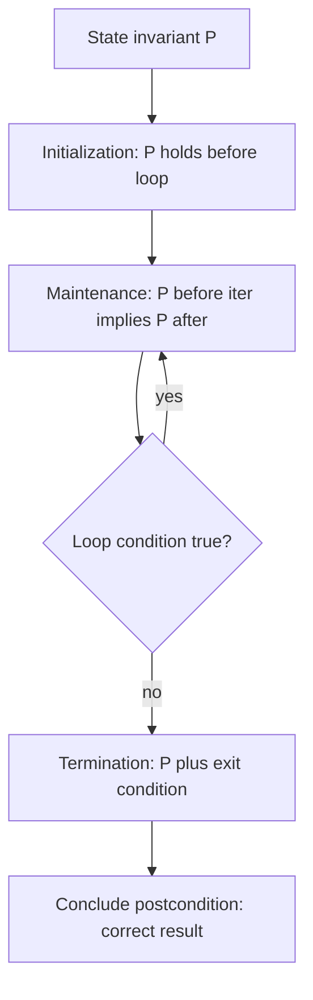

# Correctness and Invariants

## Concept

A loop invariant is a condition that is true before the loop starts and remains true after every iteration; if it also implies the goal when the loop ends, the loop is correct. Proving correctness has three parts: initialization (the invariant holds before the first iteration), maintenance (if it holds before an iteration it still holds after), and termination (the loop ends, and the invariant plus the exit condition give the desired result). Invariants turn "I tested it and it seemed fine" into "it is correct by construction." A classic example is linear search over `a[0..n-1]`: the invariant "the target is not in `a[0..i-1]`" is trivially true before the loop, preserved each time we check `a[i]`, and on termination tells us the target is absent. Choosing the right invariant is often the key insight that makes an algorithm obviously correct.

## Mermaid



## Complexity

- Reasoning with invariants adds no runtime cost; it is a proof technique applied at design time.
- For the linear-search example below: Time `O(n)`, Space `O(1)`.

## C++11 Code

```cpp
#include <vector>
using namespace std;

// Linear search proven via a loop invariant.
// Invariant P: target does not appear in a[0 .. i-1].
int indexOf(const vector<int>& a, int target) {
    for (size_t i = 0; i < a.size(); ++i) {
        // Initialization: at i=0, a[0..-1] is empty, so P holds vacuously.
        // Maintenance: P held for a[0..i-1]; we now inspect a[i].
        if (a[i] == target) return (int)i;  // found: exit with correct index
        // If not equal, target is absent from a[0..i], so P holds for i+1.
    }
    // Termination: loop ended with i == size, so P says target is absent in a[0..n-1].
    return -1;
}
```

## Mini Usage Example

```cpp
vector<int> a = {10, 20, 30, 40};
int pos  = indexOf(a, 30); // pos == 2
int miss = indexOf(a, 99); // miss == -1
(void)pos; (void)miss;
```

## Code Snippet Flow

```mermaid
flowchart LR
    A[Invariant: target not in a[0..i-1]] --> B{a[i] == target?}
    B -->|yes| C[Return i]
    B -->|no| D[Invariant now holds for i+1]
    D --> E{More elements?}
    E -->|yes| B
    E -->|no| F[Return -1: provably absent]
```
