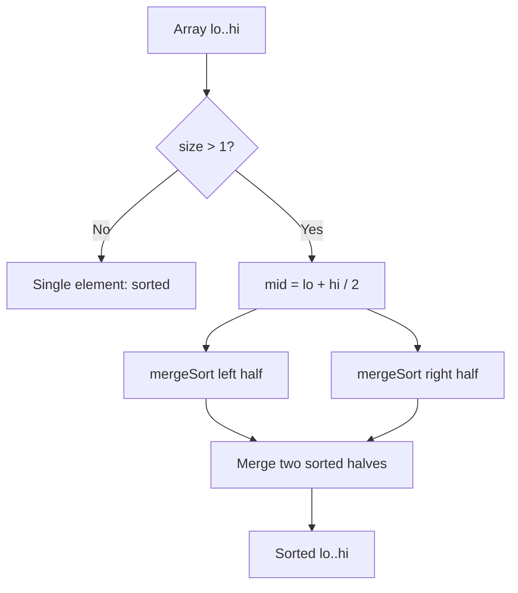
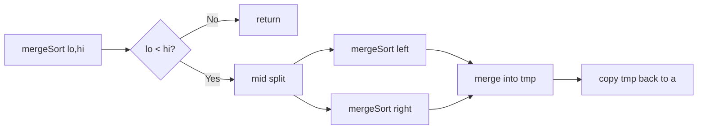

# Merge Sort

## Concept

Merge Sort is a divide-and-conquer sort. It splits the array into two halves, recursively sorts each half, then **merges** the two sorted halves into one sorted whole by repeatedly taking the smaller front element of the two. The key idea is the merge step: combining two already-sorted runs takes only linear time. This gives a guaranteed O(n log n) in every case, and the merge can be done in a way that preserves the relative order of equal elements, so Merge Sort is stable. It needs O(n) auxiliary space, which is its main drawback versus in-place sorts; it shines for linked lists and external/large-data sorting.

## Mermaid



## Complexity

- Time (Best): O(n log n)
- Time (Average): O(n log n)
- Time (Worst): O(n log n) — guaranteed, input-independent
- Space: O(n) — auxiliary buffer for merging
- Stable: Yes

## C++11 Code

```cpp
#include <vector>
using namespace std;

// Merge the two sorted runs a[lo..mid] and a[mid+1..hi] back into a.
void merge(vector<int>& a, int lo, int mid, int hi) {
    vector<int> tmp;
    tmp.reserve(hi - lo + 1);
    int i = lo, j = mid + 1;
    // Repeatedly take the smaller front element of the two runs.
    while (i <= mid && j <= hi) {
        if (a[i] <= a[j]) tmp.push_back(a[i++]); // <= keeps it stable
        else              tmp.push_back(a[j++]);
    }
    while (i <= mid) tmp.push_back(a[i++]);      // leftover from left run
    while (j <= hi)  tmp.push_back(a[j++]);      // leftover from right run
    for (int k = 0; k < (int)tmp.size(); ++k)    // copy merged run back
        a[lo + k] = tmp[k];
}

void mergeSort(vector<int>& a, int lo, int hi) {
    if (lo >= hi) return;                 // 0 or 1 element: already sorted
    int mid = lo + (hi - lo) / 2;
    mergeSort(a, lo, mid);                // sort left half
    mergeSort(a, mid + 1, hi);            // sort right half
    merge(a, lo, mid, hi);                // combine the two sorted halves
}

void mergeSort(vector<int>& a) {
    if (!a.empty()) mergeSort(a, 0, (int)a.size() - 1);
}
```

## Mini Usage Example

```cpp
vector<int> a = {5, 1, 4, 2, 8, 3};
mergeSort(a);
// a is now {1, 2, 3, 4, 5, 8}
```

## Code Snippet Flow


