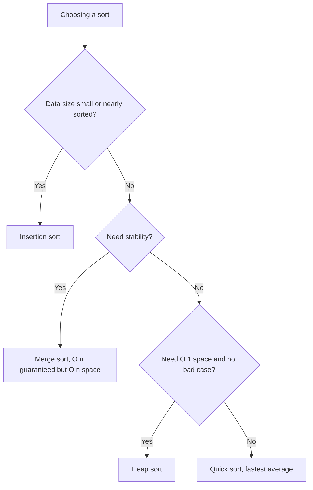
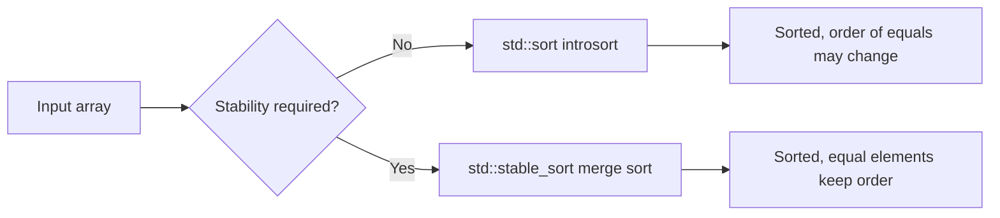

# Sorting Complexity Table

## Concept

This is a reference comparing the common comparison-based sorting algorithms in this chapter by time complexity (best / average / worst), auxiliary space, and stability. "Stable" means equal elements keep their original relative order — important when sorting records by a secondary key. Use it to pick the right algorithm: insertion sort for tiny or nearly-sorted inputs, merge sort when you need a stable guaranteed O(n log n), quick sort for fast average in-memory sorting, and heap sort when you need O(n log n) worst case with O(1) extra space.

## Mermaid



## Complexity

| Algorithm      | Best        | Average     | Worst       | Space     | Stable? |
| -------------- | ----------- | ----------- | ----------- | --------- | ------- |
| Bubble Sort    | O(n)        | O(n^2)      | O(n^2)      | O(1)      | Yes     |
| Selection Sort | O(n^2)      | O(n^2)      | O(n^2)      | O(1)      | No      |
| Insertion Sort | O(n)        | O(n^2)      | O(n^2)      | O(1)      | Yes     |
| Merge Sort     | O(n log n)  | O(n log n)  | O(n log n)  | O(n)      | Yes     |
| Quick Sort     | O(n log n)  | O(n log n)  | O(n^2)      | O(log n)  | No      |
| Heap Sort      | O(n log n)  | O(n log n)  | O(n log n)  | O(1)      | No      |

Notes:
- `std::sort` is typically an **introsort**: it starts as quicksort, switches to heap sort when recursion gets too deep (guaranteeing O(n log n) worst case), and uses insertion sort for small partitions. It is fast but **not stable**.
- `std::stable_sort` is usually a bottom-up merge sort: stable, O(n log n), with O(n) extra memory (degrading to O(n log^2 n) if it cannot allocate).
- **Timsort** (used by Python and Java for objects) is a hybrid of merge sort and insertion sort that exploits existing sorted "runs"; it is stable and runs in O(n) on already-sorted data.

## C++11 Code

```cpp
#include <vector>
#include <algorithm> // std::sort, std::stable_sort
using namespace std;

void demoLibrarySorts(vector<int>& a) {
    vector<int> b = a;

    // Introsort: O(n log n) worst case, in place, NOT stable.
    sort(a.begin(), a.end());

    // Merge-sort based: O(n log n), uses O(n) memory, IS stable.
    stable_sort(b.begin(), b.end());
}
```

## Mini Usage Example

```cpp
vector<int> data = {4, 2, 8, 1, 2};
demoLibrarySorts(data);
// data is now {1, 2, 2, 4, 8}
```

## Code Snippet Flow


