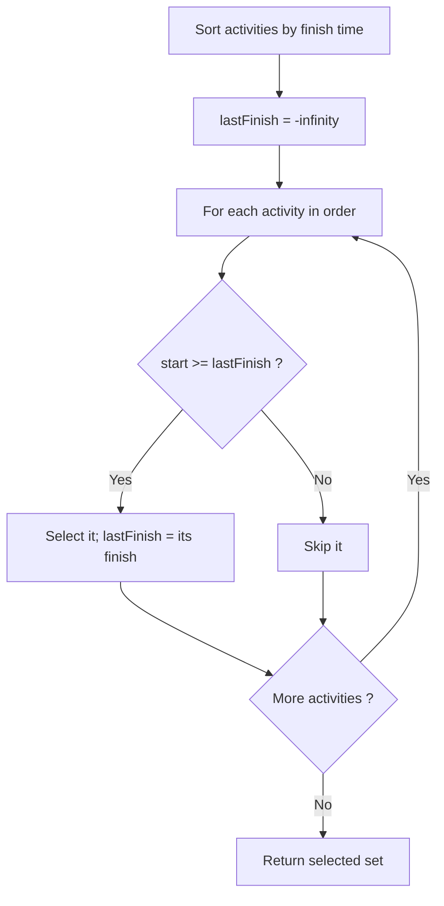
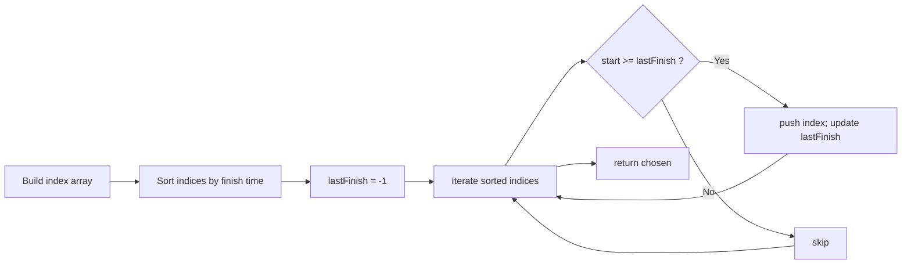

# Activity Selection

## Concept

Activity selection finds the maximum number of mutually compatible activities from a set, where each activity has a start and finish time and two activities conflict if their intervals overlap. The greedy strategy is to always pick the activity that finishes earliest among those still compatible: sort all activities by finish time, then scan left to right, selecting an activity whenever its start time is at least the finish time of the last selected one. Choosing the earliest finishing activity leaves the most room for future activities, which is why the greedy choice is optimal here (provable by an exchange argument). This is the canonical interval-scheduling problem and runs in O(n log n) dominated by the sort.

## Mermaid



## Complexity

- Time: O(n log n) for the sort by finish time; the greedy scan that follows is O(n).
- Space: O(n) for the index/order array (O(1) extra if sorted in place and only the count is needed).

## C++11 Code

```cpp
#include <vector>
#include <algorithm>

struct Activity {
    int start;
    int finish;
};

// Returns the indices (into the original vector) of a maximum-size set
// of mutually compatible activities.
std::vector<int> selectActivities(const std::vector<Activity>& acts) {
    int n = static_cast<int>(acts.size());
    std::vector<int> order(n);
    for (int i = 0; i < n; ++i) order[i] = i;

    // Sort indices by finish time ascending (the greedy key).
    std::sort(order.begin(), order.end(),
              [&acts](int a, int b) {
                  return acts[a].finish < acts[b].finish;
              });

    std::vector<int> chosen;
    int lastFinish = -1;                 // finish time of last picked activity
    for (int idx : order) {
        // Compatible if it starts at or after the last selected finish.
        if (acts[idx].start >= lastFinish) {
            chosen.push_back(idx);
            lastFinish = acts[idx].finish;
        }
    }
    return chosen;
}
```

## Mini Usage Example

```cpp
#include <iostream>

int main() {
    std::vector<Activity> acts = {
        {1, 4}, {3, 5}, {0, 6}, {5, 7}, {3, 9}, {5, 9},
        {6, 10}, {8, 11}, {8, 12}, {2, 14}, {12, 16}
    };
    std::vector<int> picked = selectActivities(acts);
    std::cout << "Count: " << picked.size() << "\n";  // 4
    for (int i : picked)
        std::cout << "[" << acts[i].start << "," << acts[i].finish << "] ";
    std::cout << "\n";  // e.g. [1,4] [5,7] [8,11] [12,16]
    return 0;
}
```

## Code Snippet Flow


