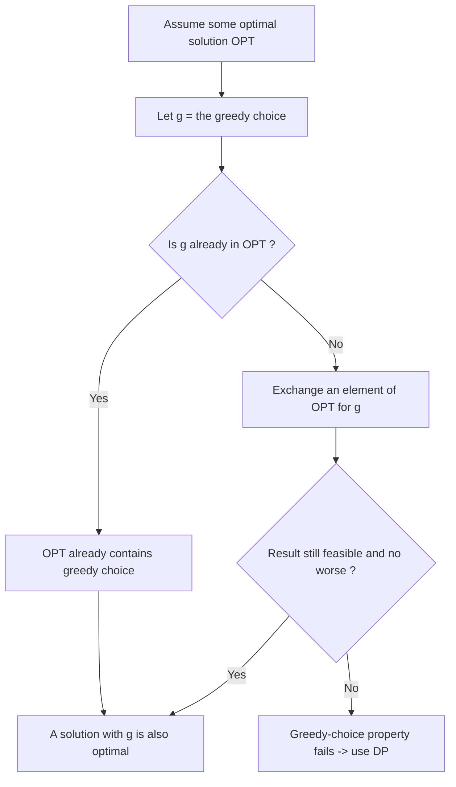
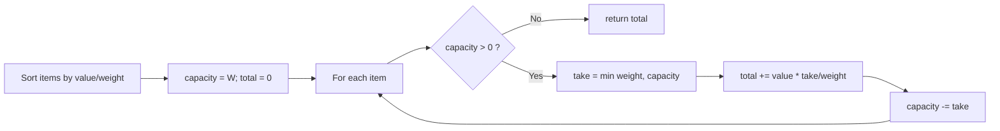

# Greedy Choice Property

## Concept

The greedy-choice property is the condition that makes a greedy algorithm correct: it says a globally optimal solution can be reached by making a locally optimal (greedy) choice at each step, without ever reconsidering earlier choices. It is one of two ingredients greedy algorithms need; the other is optimal substructure (an optimal solution contains optimal solutions to subproblems). You prove the property with an **exchange argument**: take any optimal solution, then show you can swap one of its elements for the greedy choice without making the solution worse, so a solution containing the greedy choice is also optimal. When the property fails, greedy gives a suboptimal answer and you must fall back to dynamic programming or backtracking. A classic failure is making change with coin set {1, 3, 4} for amount 6: greedy picks 4+1+1 (three coins) but the optimum is 3+3 (two coins).

## Mermaid



## Complexity

- This is a correctness property, not an algorithm, so it has no runtime of its own.
- When it holds, greedy algorithms are typically O(n log n) (a sort to order choices) or O(n) (a single pass).
- When it fails, the optimal alternative (dynamic programming) is usually polynomial but with a higher degree, e.g. O(n * W) for knapsack-style problems.

## C++11 Code

```cpp
#include <vector>
#include <algorithm>

// Demonstrates the greedy-choice property succeeding: fractional knapsack.
// Greedy choice = take items in decreasing value-to-weight ratio.
// An exchange argument shows replacing any lower-ratio fraction with a
// higher-ratio one never decreases total value, so greedy is optimal.
struct Item { double value; double weight; };

double fractionalKnapsack(std::vector<Item> items, double capacity) {
    // Order by value density (the greedy key).
    std::sort(items.begin(), items.end(), [](const Item& a, const Item& b) {
        return (a.value / a.weight) > (b.value / b.weight);
    });

    double total = 0.0;
    for (const Item& it : items) {
        if (capacity <= 0.0) break;
        double take = std::min(it.weight, capacity); // take as much as fits
        total += it.value * (take / it.weight);      // value of the fraction
        capacity -= take;
    }
    return total;
}
```

## Mini Usage Example

```cpp
#include <iostream>

int main() {
    std::vector<Item> items = {{60, 10}, {100, 20}, {120, 30}};
    double best = fractionalKnapsack(items, 50);
    std::cout << best << "\n";  // 240 (all of items 1,2 plus 2/3 of item 3)
    return 0;
}
```

## Code Snippet Flow


