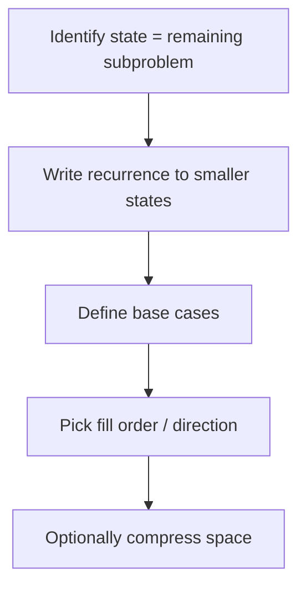
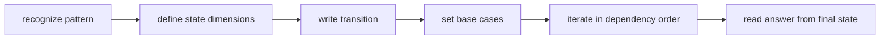

# DP Patterns

## Concept

Most dynamic programming problems fall into a handful of recurring patterns. Recognizing the pattern tells you how to define the **state** (what the indices/dimensions mean), the **transition** (how a state is built from smaller ones), and the iteration order. This page catalogs the common families: 1D linear, 2D grid, knapsack/subset, interval, bitmask (subset-state), and digit DP. For any new problem the workflow is the same: identify the smallest piece of "remaining work" as the state, write the recurrence relating it to smaller states, pin down base cases, then choose top-down or bottom-up.

## Mermaid



## Complexity

- Rule of thumb: Time = (number of states) * (work per transition).
- Space = number of states, frequently reducible by keeping only the active frontier.

| Pattern | Typical state | Transition idea | Example problems |
| --- | --- | --- | --- |
| 1D linear | `dp[i]` = answer up to index `i` | combine a few previous `dp[j]` | Fibonacci, house robber, climbing stairs |
| 2D grid | `dp[r][c]` = answer reaching cell `(r,c)` | from `dp[r-1][c]`, `dp[r][c-1]` | unique paths, min path sum, edit distance, LCS |
| Knapsack / subset | `dp[i][w]` = best using first `i` items, budget `w` | take vs skip item `i` | 0/1 knapsack, subset sum, coin change |
| Interval | `dp[l][r]` = answer for subrange `[l,r]` | split at `k` in `[l,r]`, combine halves | matrix chain mult., burst balloons, optimal BST |
| Bitmask | `dp[mask]` = answer over the chosen subset `mask` | add one unused element to the mask | TSP, assignment, set cover (small n) |
| Digit | `dp[pos][tight][...]` over digits of a number | place next digit, track bound/carry | count numbers with a property in `[L,R]` |

## C++11 Code

```cpp
#include <vector>
#include <algorithm>
#include <climits>

// 2D grid pattern: minimum path sum from top-left to bottom-right,
// moving only right or down. State dp[r][c] = cheapest cost to reach (r,c).
int minPathSum(const std::vector<std::vector<int>>& grid) {
    int R = static_cast<int>(grid.size());
    if (R == 0) return 0;
    int C = static_cast<int>(grid[0].size());
    std::vector<std::vector<int>> dp(R, std::vector<int>(C, 0));
    for (int r = 0; r < R; ++r) {
        for (int c = 0; c < C; ++c) {
            if (r == 0 && c == 0) {
                dp[r][c] = grid[r][c];            // base case: start cell
            } else {
                int best = INT_MAX;
                if (r > 0) best = std::min(best, dp[r - 1][c]); // from above
                if (c > 0) best = std::min(best, dp[r][c - 1]); // from left
                dp[r][c] = best + grid[r][c];     // transition
            }
        }
    }
    return dp[R - 1][C - 1];
}
```

## Mini Usage Example

```cpp
#include <iostream>

int main() {
    std::vector<std::vector<int>> grid = {
        {1, 3, 1},
        {1, 5, 1},
        {4, 2, 1}
    };
    // Cheapest path 1->3->1->1->1 sums to 7.
    std::cout << minPathSum(grid) << "\n";  // prints 7
    return 0;
}
```

## Code Snippet Flow


