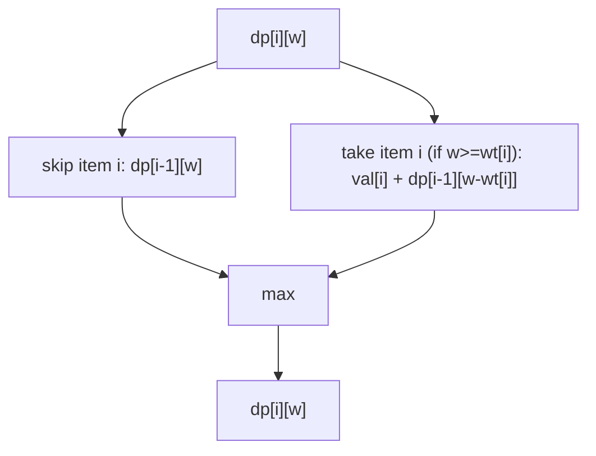
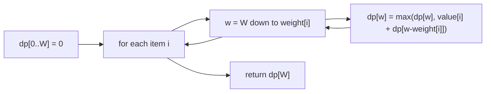

# Knapsack 01

## Concept

The 0/1 knapsack problem: given `n` items each with a weight and a value, and a knapsack of capacity `W`, choose a subset that maximizes total value without exceeding `W`. "0/1" means each item is either taken whole or skipped — no fractions. Define the **state** `dp[i][w]` = the best value achievable using the first `i` items with capacity `w`. The **recurrence** is `dp[i][w] = max(dp[i-1][w], value[i] + dp[i-1][w - weight[i]])`, the better of skipping or taking item `i` (taking only allowed when `weight[i] <= w`). The **base case** is `dp[0][w] = 0` (no items, no value). Iterating capacity in reverse lets us compress the table to a single 1D row of size `W+1`.

## Mermaid



## Complexity

- Time: O(n * W) — fill an `n` by `W` table.
- Space: O(n * W) for the 2D table, O(W) with the 1D rolling row.

## C++11 Code

```cpp
#include <vector>
#include <algorithm>

// 1D bottom-up 0/1 knapsack. dp[w] = best value for capacity w using
// items processed so far. We iterate w downward so each item is used
// at most once (a forward sweep would allow reusing an item -> unbounded).
int knapsack01(const std::vector<int>& weight,
               const std::vector<int>& value,
               int W) {
    int n = static_cast<int>(weight.size());
    std::vector<int> dp(W + 1, 0);              // base case: 0 items -> value 0
    for (int i = 0; i < n; ++i) {
        // Reverse iteration enforces the "0/1" (take-once) constraint.
        for (int w = W; w >= weight[i]; --w) {
            // max(skip, take): take adds value[i] on top of the best
            // solution for the remaining capacity w - weight[i].
            dp[w] = std::max(dp[w], value[i] + dp[w - weight[i]]);
        }
    }
    return dp[W];
}
```

## Mini Usage Example

```cpp
#include <iostream>

int main() {
    std::vector<int> weight = {1, 3, 4, 5};
    std::vector<int> value  = {1, 4, 5, 7};
    int W = 7;
    // Best subset: items {3,4} (weight 3+4=7, value 4+5=9).
    std::cout << knapsack01(weight, value, W) << "\n";  // prints 9
    return 0;
}
```

## Code Snippet Flow


