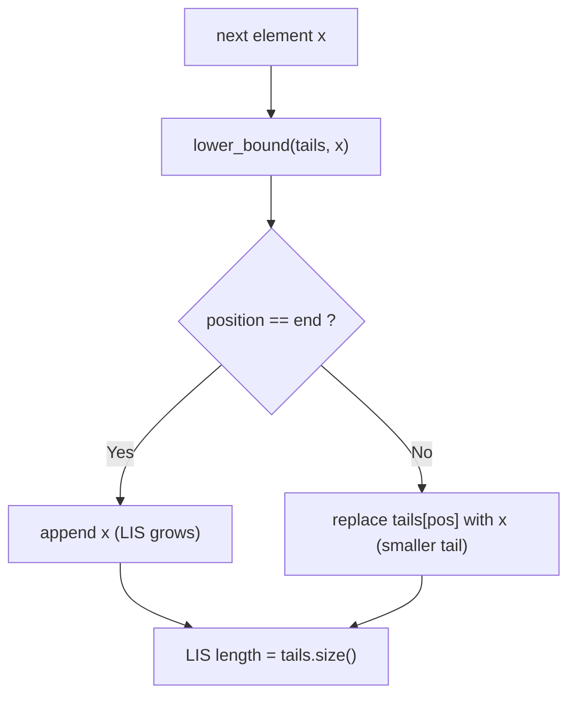
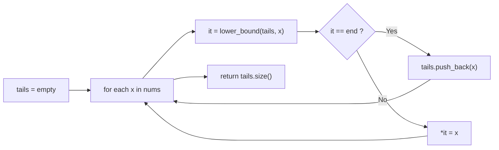

# Longest Increasing Subsequence

## Concept

Given an array of `n` numbers, the longest increasing subsequence (LIS) is the longest subsequence whose elements are strictly increasing (not necessarily contiguous). A simple O(n^2) DP defines `dp[i]` = length of the LIS ending at index `i`. The faster **patience-sorting** method maintains an auxiliary array `tails`, where `tails[k]` is the smallest possible tail value of any increasing subsequence of length `k+1`. For each element `x` we binary-search (`std::lower_bound`) for the first tail `>= x`: if found we overwrite it (a better, smaller tail for that length), otherwise we append `x` (extending the longest subsequence). The final LIS length is the size of `tails`. The `tails` array is not itself a valid subsequence, but its length is always correct.

## Mermaid



## Complexity

- Time: O(n log n) — one binary search per element.
- Space: O(n) for the `tails` array.

## C++11 Code

```cpp
#include <vector>
#include <algorithm>

// Patience sorting: returns the length of the strictly-increasing LIS.
// tails[k] = smallest possible tail of an increasing subsequence of
// length k+1. tails is kept sorted, enabling binary search.
int lisLength(const std::vector<int>& nums) {
    std::vector<int> tails;
    for (int x : nums) {
        // First tail value >= x. lower_bound keeps it strictly increasing;
        // use upper_bound instead for a non-decreasing (>=) variant.
        std::vector<int>::iterator it =
            std::lower_bound(tails.begin(), tails.end(), x);
        if (it == tails.end()) {
            tails.push_back(x);   // x extends the longest subsequence
        } else {
            *it = x;              // x is a smaller tail for that length
        }
    }
    return static_cast<int>(tails.size());
}
```

## Mini Usage Example

```cpp
#include <iostream>

int main() {
    std::vector<int> nums = {10, 9, 2, 5, 3, 7, 101, 18};
    // One LIS is {2, 3, 7, 18} (or {2,3,7,101}), length 4.
    std::cout << lisLength(nums) << "\n";  // prints 4
    return 0;
}
```

## Code Snippet Flow


