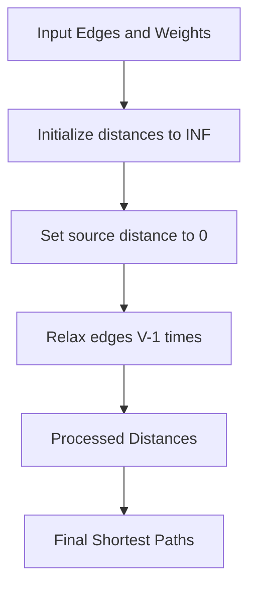

# Bellman Ford

## Concept

Bellman-Ford computes single-source shortest paths and, unlike Dijkstra, tolerates negative edge weights. It relaxes every edge repeatedly: after k full passes over all edges, every shortest path using at most k edges is correct, so V-1 passes suffice for any simple path in a V-vertex graph. A final extra pass detects negative cycles: if any edge can still be relaxed, a negative-weight cycle is reachable and no shortest path is well-defined. It runs in O(V*E), slower than Dijkstra, but is the standard choice when negative weights are present or when you must detect negative cycles (e.g., currency-arbitrage checks).

## Mermaid



## Complexity

- Time: O(VE)
- Space: O(V)

## C++11 Code

```cpp
#include <vector>
#include <limits>
using namespace std;

const long long INF = numeric_limits<long long>::max() / 2;

vector<long long> bellmanFord(int src, int n, const vector<tuple<int, int, int> >& edges) {
    vector<long long> dist(n, INF);
    dist[src] = 0;
    
    for (int i = 0; i < n - 1; i++) {
        for (const auto& e : edges) {
            int u = get<0>(e);
            int v = get<1>(e);
            int w = get<2>(e);
            if (dist[u] != INF && dist[u] + w < dist[v]) {
                dist[v] = dist[u] + w;
            }
        }
    }
    
    return dist;
}
```

## Mini Usage Example

```cpp
vector<tuple<int, int, int> > edges = {{0, 1, 4}, {0, 2, 2}, {1, 2, 1}, {1, 3, 5}, {2, 3, 8}};
vector<long long> dist = bellmanFord(0, 4, edges);
```

## Code Snippet Flow

```mermaid
flowchart LR
    A[Initialize all distances to INF] --> B[Set source to 0]
    B --> C[For each of V-1 iterations]
    C --> D[For each edge u-v-w]
    D --> E{dist[u] != INF?}
    E -- Yes --> F{dist[u] + w < dist[v]?}
    F -- Yes --> G[Update dist[v]]
    G --> H[Continue next edge]
    E -- No --> H
    F -- No --> H
    H --> I[Return final distances]
```