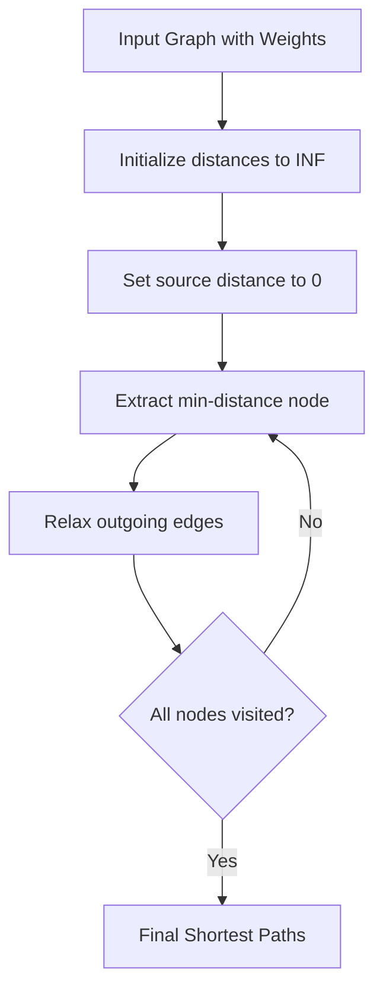

# Dijkstra

## Concept

Dijkstra's algorithm computes shortest paths from a single source in a graph with non-negative edge weights. It maintains a tentative distance array, repeatedly extracting the unsettled vertex with the smallest known distance and relaxing its outgoing edges (updating a neighbor's distance when a shorter path through the current vertex is found). A min-priority queue makes extraction efficient; because weights are non-negative, once a vertex is popped with its minimal distance that value is final. The lazy variant pushes duplicate entries and skips a popped entry whose stored distance exceeds the recorded distance. Use it for road networks, routing, and any non-negative weighted shortest-path query; for negative edges use Bellman-Ford instead.

## Mermaid



## Complexity

- Time: O((V+E) log V)
- Space: O(V+E)

## C++11 Code

```cpp
#include <vector>
#include <queue>
#include <limits>
using namespace std;

const long long INF = numeric_limits<long long>::max() / 2;

vector<long long> dijkstra(int src, int n, const vector<vector<pair<int, int> > >& g) {
    vector<long long> dist(n, INF);
    priority_queue<pair<long long, int>, vector<pair<long long, int> >, greater<pair<long long, int> > > pq;
    
    dist[src] = 0;
    pq.push(make_pair(0, src));
    
    while (!pq.empty()) {
        pair<long long, int> top = pq.top();
        pq.pop();
        long long d = top.first;
        int u = top.second;
        
        if (d > dist[u]) continue;
        
        for (const auto& edge : g[u]) {
            int v = edge.first;
            int w = edge.second;
            if (dist[u] + w < dist[v]) {
                dist[v] = dist[u] + w;
                pq.push(make_pair(dist[v], v));
            }
        }
    }
    
    return dist;
}
```

## Mini Usage Example

```cpp
vector<vector<pair<int, int> > > g(4);
g[0].push_back(make_pair(1, 4));
g[0].push_back(make_pair(2, 2));
g[1].push_back(make_pair(2, 1));
g[1].push_back(make_pair(3, 5));
g[2].push_back(make_pair(3, 8));
vector<long long> dist = dijkstra(0, 4, g);
```

## Code Snippet Flow

```mermaid
flowchart LR
    A[Initialize all distances to INF] --> B[Set source to 0]
    B --> C[Push source to priority queue]
    C --> D[While priority queue not empty]
    D --> E[Extract min-distance node u]
    E --> F{dist[current] > dist[u]?}
    F -- Yes --> G[Skip this node]
    F -- No --> H[For each neighbor v of u]
    H --> I{dist[u] + weight < dist[v]?}
    I -- Yes --> J[Update dist[v]]
    J --> K[Push v to priority queue]
    K --> L[Continue]
    G --> L
    I -- No --> L
    L --> M{More nodes in queue?}
    M -- Yes --> D
    M -- No --> N[Return final distances]
```