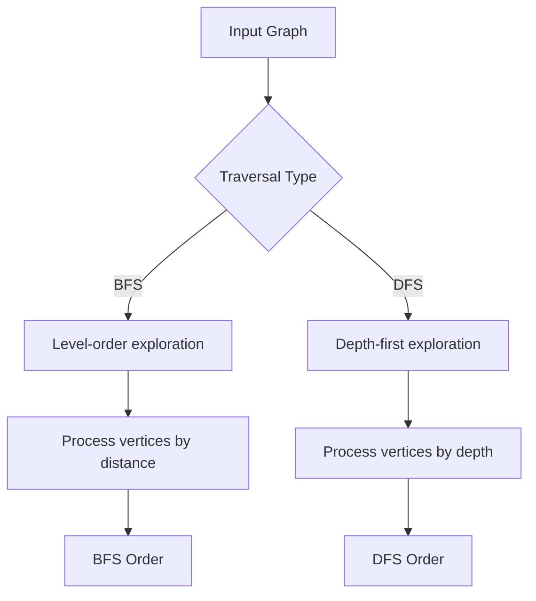
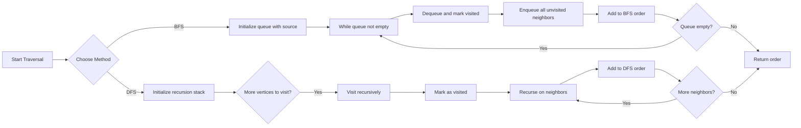

# Traversals

## Concept

Graph traversal systematically visits every reachable vertex from a source, using a "visited" set to avoid revisiting nodes (which also prevents infinite loops on cycles). Breadth-first search (BFS) uses a FIFO queue, exploring vertices in increasing order of edge-distance from the source, so it naturally yields shortest paths in unweighted graphs. Depth-first search (DFS) follows one branch as far as possible before backtracking, typically via recursion (an implicit stack) or an explicit stack. Both run in O(V+E) on an adjacency list. Use BFS for shortest-hop or level-order problems and DFS for cycle detection, topological ordering, and connectivity analysis.

## Mermaid



## Complexity

- Time: O(V+E)
- Space: O(V)

## C++11 Code

```cpp
#include <vector>
#include <queue>
#include <stack>
using namespace std;

vector<int> bfsTraversal(int src, const vector<vector<int> >& g) {
    vector<int> vis(g.size(), 0), order;
    queue<int> q;
    vis[src] = 1;
    q.push(src);

    while (!q.empty()) {
        int u = q.front(); q.pop();
        order.push_back(u);
        for (int v : g[u]) {
            if (!vis[v]) {
                vis[v] = 1;
                q.push(v);
            }
        }
    }
    return order;
}

void dfsHelper(int u, const vector<vector<int> >& g, vector<int>& vis, vector<int>& order) {
    vis[u] = 1;
    order.push_back(u);
    for (int v : g[u]) {
        if (!vis[v]) {
            dfsHelper(v, g, vis, order);
        }
    }
}

vector<int> dfsTraversal(int src, const vector<vector<int> >& g) {
    vector<int> vis(g.size(), 0), order;
    dfsHelper(src, g, vis, order);
    return order;
}
```

## Mini Usage Example

```cpp
vector<vector<int> > g = {{1, 2}, {0, 3}, {0, 3}, {1, 2}};
vector<int> bfsOrder = bfsTraversal(0, g);
vector<int> dfsOrder = dfsTraversal(0, g);
```

## Code Snippet Flow

