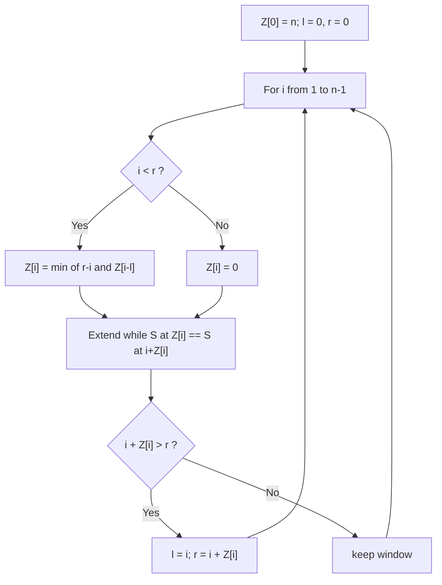
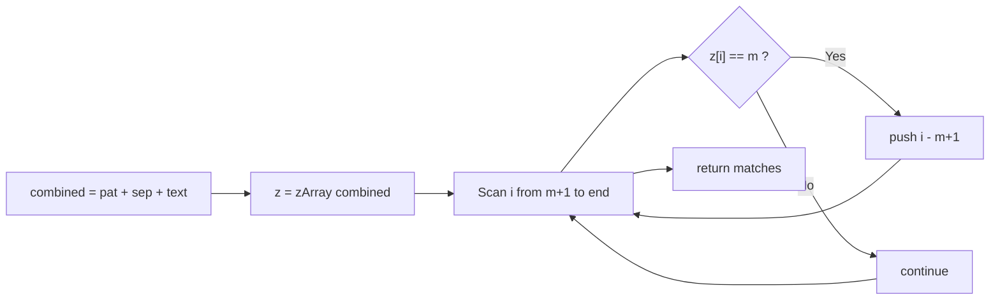

# Z Algorithm

## Concept

The Z algorithm computes, for a string `S` of length `n`, an array `Z` where `Z[i]` is the length of the longest substring starting at position `i` that matches a prefix of `S`. It builds this array in linear time by maintaining a window `[l, r]` -- the rightmost segment known to match the prefix. For each new index `i` inside the window it reuses the already-computed value `Z[i - l]` as a head start, then extends by direct comparison only when necessary, and slides the window right. To search for a pattern `P` in text `T`, run the Z algorithm on the concatenation `P + separator + T`; any position where `Z[i]` equals `m` (the pattern length) marks an occurrence. Total work is O(n + m) because the right boundary `r` only moves forward.

## Mermaid



## Complexity

- Time: O(n + m) -- linear in the length of the combined string `P + sep + T`.
- Space: O(n + m) for the Z array over the combined string.

## C++11 Code

```cpp
#include <string>
#include <vector>
#include <algorithm>

// Compute the Z array of s: z[i] = length of longest prefix of s
// that starts at position i. z[0] is conventionally 0 here.
std::vector<int> zArray(const std::string& s) {
    int n = static_cast<int>(s.size());
    std::vector<int> z(n, 0);
    int l = 0, r = 0;                 // current rightmost match window [l, r)
    for (int i = 1; i < n; ++i) {
        if (i < r)
            z[i] = std::min(r - i, z[i - l]);   // reuse work inside the window
        while (i + z[i] < n && s[z[i]] == s[i + z[i]])
            ++z[i];                              // extend by direct comparison
        if (i + z[i] > r) {                      // slide the window right
            l = i;
            r = i + z[i];
        }
    }
    return z;
}

// Find all occurrences of pat in text using the Z array on pat + sep + text.
std::vector<int> zSearch(const std::string& text, const std::string& pat) {
    std::vector<int> matches;
    int m = static_cast<int>(pat.size());
    if (m == 0 || m > static_cast<int>(text.size())) return matches;

    // Separator must not appear in either string (use '\1').
    std::string combined = pat + '\1' + text;
    std::vector<int> z = zArray(combined);
    for (int i = m + 1; i < static_cast<int>(combined.size()); ++i) {
        if (z[i] == m)
            matches.push_back(i - (m + 1));      // map back to text index
    }
    return matches;
}
```

## Mini Usage Example

```cpp
#include <iostream>

int main() {
    std::vector<int> hits = zSearch("aabxaabxcaabxaabxay", "aabx");
    for (int p : hits) std::cout << p << " ";  // 0 4 9 13
    std::cout << "\n";
    return 0;
}
```

## Code Snippet Flow


