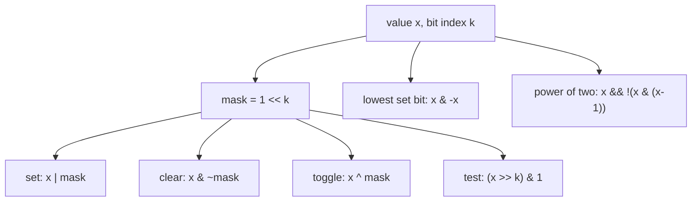
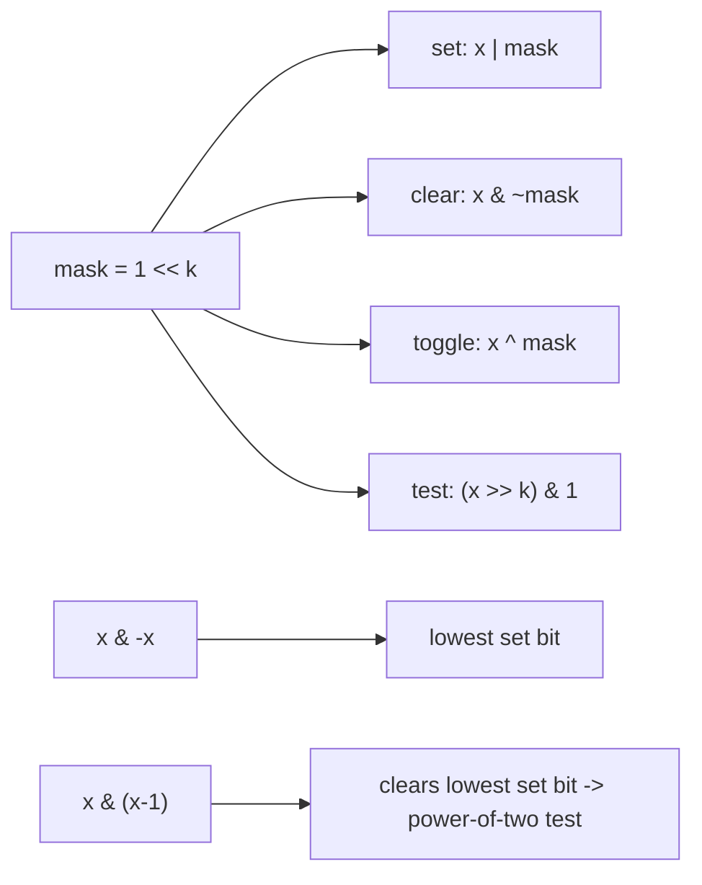

# Bit Operations

## Concept

Bit operations manipulate the individual binary digits of an integer using the
bitwise operators `&`, `|`, `^`, `~`, and the shifts `<<` and `>>`. The core
single-bit tricks build a mask `1 << k` and combine it: OR to set a bit, AND
with the complement to clear it, XOR to toggle it, and AND to test it. Several
classic idioms fall out of this: `x & -x` isolates the lowest set bit (using
two's-complement negation), `x & (x - 1)` clears that lowest set bit (so
`x & (x - 1) == 0` detects powers of two), and counting the set bits answers
"how many flags are on." Bit operations are O(1) on machine words and underpin
flags, masks, and many number-theory and combinatorics tricks.

## Mermaid



## Complexity

- Time: O(1) per operation -- each works on a fixed-width machine word.
- Space: O(1).

## C++11 Code

```cpp
#include <cstdint>
using namespace std;

// --- Single-bit operations (k counted from the least-significant bit) ---
unsigned setBit(unsigned x, int k)    { return x | (1u << k);  } // turn bit on
unsigned clearBit(unsigned x, int k)  { return x & ~(1u << k); } // turn bit off
unsigned toggleBit(unsigned x, int k) { return x ^ (1u << k);  } // flip the bit
bool     testBit(unsigned x, int k)   { return (x >> k) & 1u;  } // read the bit

// Isolate the lowest set bit, e.g. 0b10100 -> 0b00100.
// Relies on two's-complement: -x == ~x + 1.
unsigned lowestSetBit(unsigned x)     { return x & (0u - x); }

// Count the number of 1 bits. __builtin_popcount is a GCC/Clang builtin
// (often a single CPU instruction); on MSVC use __popcnt instead.
int countBits(unsigned x)             { return __builtin_popcount(x); }

// A positive power of two has exactly one set bit, so clearing it yields 0.
bool isPowerOfTwo(unsigned x)         { return x != 0 && (x & (x - 1)) == 0; }
```

## Mini Usage Example

```cpp
unsigned x = 0b1010;             // = 10
x = setBit(x, 0);                // 0b1011 = 11
bool t = testBit(x, 1);          // true (bit 1 is set)
int n = countBits(x);            // 3
bool p = isPowerOfTwo(16);       // true
(void)t; (void)n; (void)p;
```

## Code Snippet Flow


