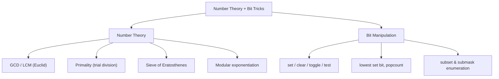
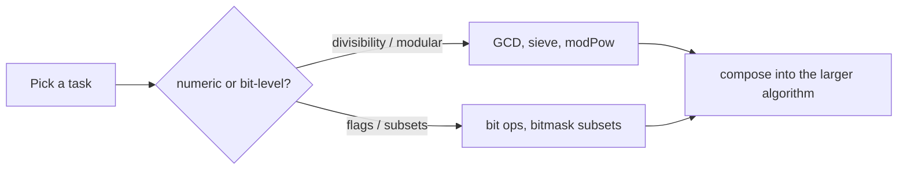

# Number Bit Overview

## Concept

This chapter pairs two toolkits that show up constantly in algorithm work:
elementary number theory (divisibility, primes, modular arithmetic) and bit
manipulation (treating an integer as a vector of flags). They reinforce each
other -- fast exponentiation is built from bit shifts, sieves use compact flag
arrays, and bitmasks encode subsets for combinatorial number problems. The
sections that follow drill into GCD/LCM, primality testing, the Sieve of
Eratosthenes, binary exponentiation, single-bit operations, and subset
enumeration. This overview collects the headline operations and one-line idioms
so you can recall the right tool at a glance before diving into each topic.

## Mermaid



## Complexity

- GCD (Euclid): O(log min(a, b)) time, O(1) space.
- Primality (trial division, 6k +/- 1): O(sqrt n) time, O(1) space.
- Sieve of Eratosthenes: O(n log log n) time, O(n) space.
- Fast / modular exponentiation: O(log exp) time, O(1) space.
- Single bit operations: O(1) time and space.
- All subsets: O(2^n); all submasks over all masks: O(3^n).

## C++11 Code

Cheat-table of the most-used idioms. Each expression is O(1) on a machine word
unless noted; `__builtin_popcount` is a GCC/Clang builtin (use `__popcnt` on MSVC).

| Operation | Expression | Note |
|---|---|---|
| Is bit k set | `(x >> k) & 1` | reads a single flag |
| Set bit k | `x \| (1u << k)` | turn flag on |
| Clear bit k | `x & ~(1u << k)` | turn flag off |
| Toggle bit k | `x ^ (1u << k)` | flip flag |
| Lowest set bit | `x & -x` | two's-complement isolate |
| Clear lowest set bit | `x & (x - 1)` | drops one bit |
| Is power of two | `x && !(x & (x - 1))` | exactly one bit set |
| Count set bits | `__builtin_popcount(x)` | compiler builtin |
| Multiply / divide by 2^k | `x << k` / `x >> k` | shift for unsigned |
| Even / odd test | `(x & 1) == 0` | low bit |
| GCD | `gcd(a, b) = gcd(b, a % b)` | Euclid, base case b == 0 |
| LCM (no overflow) | `a / gcd(a,b) * b` | divide before multiply |
| Modular reduce product | `(a % m) * (b % m) % m` | keep values bounded |
| Iterate all subsets | `for (m = 0; m < (1<<n); ++m)` | 2^n masks |
| Iterate submasks of m | `for (s = m; s; s = (s-1) & m)` | excludes empty set |

```cpp
#include <cstdlib>
using namespace std;

// Two anchor routines used throughout the chapter.
long long gcd(long long a, long long b) {       // Euclidean GCD
    while (b) { long long r = a % b; a = b; b = r; }
    return llabs(a);
}

long long modPow(long long base, long long exp, long long m) { // base^exp mod m
    long long r = 1 % m; base %= m;
    while (exp > 0) {
        if (exp & 1LL) r = (r * base) % m;       // fold in when low bit set
        base = (base * base) % m;                // square for next bit
        exp >>= 1LL;
    }
    return r;
}
```

## Mini Usage Example

```cpp
long long g = gcd(24, 36);                   // 12
long long e = modPow(7, 13, 1000000007LL);   // 7^13 mod 1e9+7
bool odd = (g & 1) != 0;                      // false
(void)e; (void)odd;
```

## Code Snippet Flow


