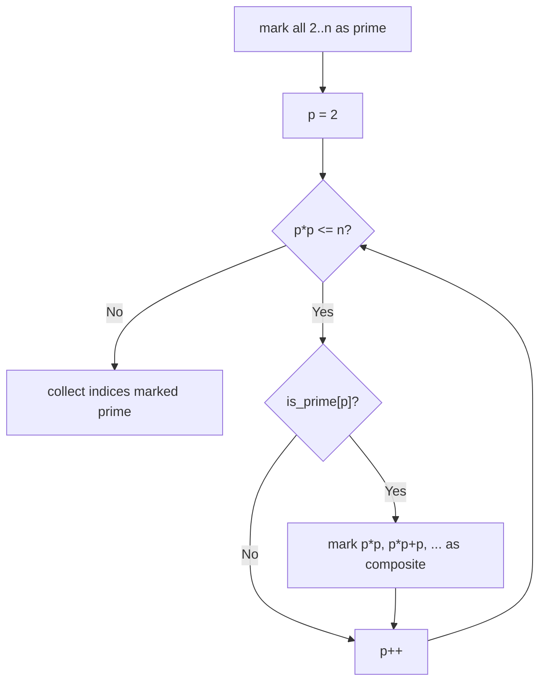
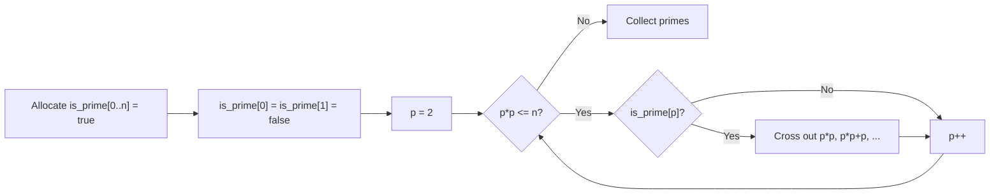

# Sieve

## Concept

The Sieve of Eratosthenes finds all prime numbers up to a limit `n` far faster
than testing each number individually. It keeps a boolean array marking every
integer as prime, then walks from the smallest prime upward: whenever it finds a
number still marked prime, it crosses out all of that number's multiples as
composite. Starting the inner crossing-out at `p*p` is correct because any
smaller multiple of `p` already has a smaller prime factor and was crossed out
earlier. After the sweep, every index still marked true is prime. Use a sieve
when you need many primes or repeated primality checks within a fixed range; for
a single large number, trial division is more memory-efficient.

## Mermaid



## Complexity

- Time: O(n log log n) -- the cost of crossing out multiples summed over all primes.
- Space: O(n) for the boolean prime-flag array.

## C++11 Code

```cpp
#include <vector>
using namespace std;

// Returns is_prime flags for 0..n and fills `primes` with the actual primes.
vector<char> sieve(int n, vector<int>& primes) {
    vector<char> is_prime(n + 1, 1);  // 1 = prime candidate, 0 = composite
    if (n >= 0) is_prime[0] = 0;      // 0 is not prime
    if (n >= 1) is_prime[1] = 0;      // 1 is not prime
    for (int p = 2; (long long)p * p <= n; ++p) {
        if (is_prime[p]) {            // p is prime: cross out its multiples
            // Start at p*p; smaller multiples were handled by smaller primes.
            for (int m = p * p; m <= n; m += p)
                is_prime[m] = 0;
        }
    }
    primes.clear();
    for (int i = 2; i <= n; ++i)      // gather everything still marked prime
        if (is_prime[i]) primes.push_back(i);
    return is_prime;
}
```

## Mini Usage Example

```cpp
vector<int> primes;
vector<char> flag = sieve(30, primes);
// primes == {2, 3, 5, 7, 11, 13, 17, 19, 23, 29}
bool is17 = flag[17] != 0;   // true
(void)is17;
```

## Code Snippet Flow


