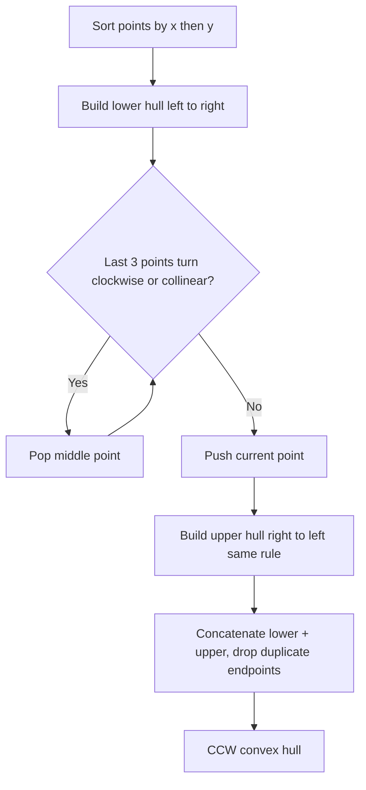
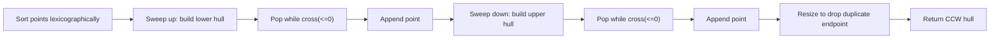

# Convex Hull

## Concept

The convex hull of a set of points is the smallest convex polygon that encloses all of them, like a rubber band snapped around a set of nails. Andrew's monotone chain algorithm first sorts the points by x (then y), then sweeps left-to-right building the lower hull and right-to-left building the upper hull. While extending a chain, it pops the previous vertex whenever the last three points make a non-left (clockwise or collinear) turn, tested with the 2D cross product; this keeps only convex corners. Concatenating the two chains (dropping the duplicated endpoints) yields the hull in counter-clockwise order. Sorting dominates the cost at O(n log n); it underpins computational-geometry tasks such as collision bounds, farthest-pair, and shape simplification.

## Mermaid



## Complexity

- Time: O(n log n), dominated by the initial sort (the two sweeps are O(n))
- Space: O(n) for the output hull

## C++11 Code

```cpp
#include <vector>
#include <algorithm>
using namespace std;

struct Point {
    long long x, y;
    bool operator<(const Point& o) const {
        return x < o.x || (x == o.x && y < o.y);
    }
};

// Cross product of OA x OB; >0 left turn (CCW), <0 right turn, =0 collinear
long long cross(const Point& O, const Point& A, const Point& B) {
    return (A.x - O.x) * (B.y - O.y) - (A.y - O.y) * (B.x - O.x);
}

// Returns hull vertices in counter-clockwise order (no repeated endpoint).
vector<Point> convexHull(vector<Point> pts) {
    int n = (int)pts.size();
    if (n < 3) return pts;                 // degenerate: line or point
    sort(pts.begin(), pts.end());

    vector<Point> hull(2 * n);
    int k = 0;

    // Lower hull
    for (int i = 0; i < n; ++i) {
        while (k >= 2 && cross(hull[k - 2], hull[k - 1], pts[i]) <= 0) --k;
        hull[k++] = pts[i];
    }

    // Upper hull (start at second-last point, end before lower's start)
    int lower = k + 1;
    for (int i = n - 2; i >= 0; --i) {
        while (k >= lower && cross(hull[k - 2], hull[k - 1], pts[i]) <= 0) --k;
        hull[k++] = pts[i];
    }

    hull.resize(k - 1);                    // drop last point (== first point)
    return hull;
}
```

## Mini Usage Example

```cpp
// A square with two interior points; hull should be the 4 corners.
vector<Point> pts = {
    {0, 0}, {4, 0}, {4, 4}, {0, 4},
    {1, 1}, {2, 2}
};
vector<Point> hull = convexHull(pts);   // 4 corner points in CCW order
(void)hull;
```

## Code Snippet Flow


