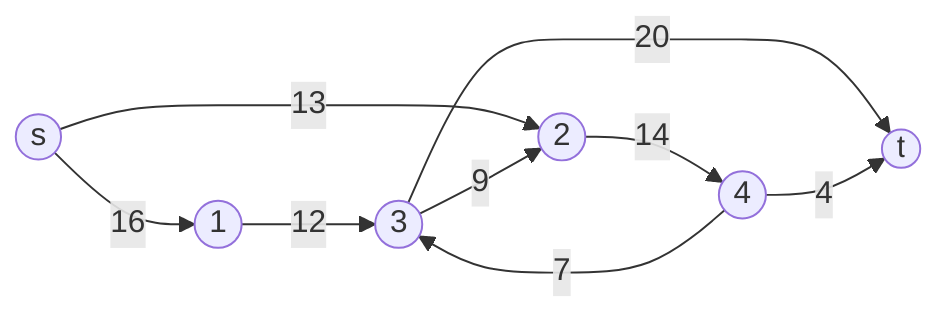
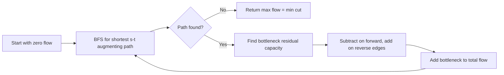

# Network Flow

## Concept

Maximum flow asks how much can be pushed from a source s to a sink t through a directed network whose edges have capacities, subject to capacity limits and flow conservation at every other node. The Ford-Fulkerson method repeatedly finds an augmenting path (one with spare capacity from s to t) in the residual graph and pushes the bottleneck amount along it, also adding reverse "cancellation" edges so later paths can reroute earlier flow. The Edmonds-Karp specialization chooses the shortest augmenting path by edge count using BFS, which bounds the number of augmentations and gives O(V*E^2) time. By the max-flow min-cut theorem the resulting value equals the capacity of the smallest s-t cut. It models bandwidth routing, bipartite matching, and project-selection problems.

## Mermaid



## Complexity

- Time: O(V * E^2) for Edmonds-Karp (BFS chooses shortest augmenting paths)
- Space: O(V^2) using a capacity matrix, or O(V + E) with adjacency lists

## C++11 Code

```cpp
#include <vector>
#include <queue>
#include <algorithm>
#include <limits>
using namespace std;

// Edmonds-Karp max flow on a residual capacity matrix.
// cap[u][v] is the capacity of edge u->v (0 if absent).
int edmondsKarp(vector<vector<int> > cap, int s, int t) {
    int n = (int)cap.size();
    const int INF = numeric_limits<int>::max();
    int maxFlow = 0;

    while (true) {
        // BFS for a shortest augmenting path; parent[] reconstructs it.
        vector<int> parent(n, -1);
        parent[s] = s;
        queue<int> q;
        q.push(s);
        while (!q.empty() && parent[t] == -1) {
            int u = q.front(); q.pop();
            for (int v = 0; v < n; ++v) {
                if (parent[v] == -1 && cap[u][v] > 0) {  // unvisited with residual
                    parent[v] = u;
                    q.push(v);
                }
            }
        }

        if (parent[t] == -1) break;          // no augmenting path: done

        // Find bottleneck residual capacity along the path t back to s.
        int bottleneck = INF;
        for (int v = t; v != s; v = parent[v])
            bottleneck = min(bottleneck, cap[parent[v]][v]);

        // Augment: subtract on forward edges, add on reverse edges.
        for (int v = t; v != s; v = parent[v]) {
            cap[parent[v]][v] -= bottleneck;
            cap[v][parent[v]] += bottleneck;
        }

        maxFlow += bottleneck;
    }

    return maxFlow;
}
```

## Mini Usage Example

```cpp
// Classic 6-node network (CLRS); source 0, sink 5. Max flow = 23.
int n = 6;
vector<vector<int> > cap(n, vector<int>(n, 0));
cap[0][1] = 16; cap[0][2] = 13;
cap[1][3] = 12;
cap[2][1] = 4;  cap[2][4] = 14;
cap[3][2] = 9;  cap[3][5] = 20;
cap[4][3] = 7;  cap[4][5] = 4;

int flow = edmondsKarp(cap, 0, 5);   // returns 23
(void)flow;
```

## Code Snippet Flow


