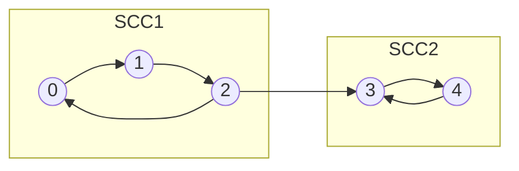

# Strongly Connected Components

## Concept

A strongly connected component (SCC) of a directed graph is a maximal set of vertices in which every vertex can reach every other vertex. Kosaraju's algorithm finds all SCCs with two depth-first searches. The first DFS on the original graph pushes each vertex onto a stack in order of finishing time, so vertices that finish last sit on top. It then transposes the graph (reverses every edge) and runs DFS popping vertices off that stack; each tree in this second pass is exactly one SCC, because reversing edges keeps vertices mutually reachable only within their own component. Both passes are linear, giving O(V+E) overall. Condensing each SCC into a single node yields a DAG, which is the basis for 2-SAT, dependency analysis, and deadlock detection.

## Mermaid



## Complexity

- Time: O(V + E) (two linear DFS passes plus building the transpose)
- Space: O(V + E) for the graphs, visited array, and finish-order stack

## C++11 Code

```cpp
#include <vector>
using namespace std;

// Kosaraju's algorithm. Returns comp[v] = SCC id of vertex v (0-based ids).
struct Kosaraju {
    int n;
    vector<vector<int> > adj, radj;   // graph and its transpose
    vector<int> order, comp;
    vector<char> visited;

    Kosaraju(int n_) : n(n_), adj(n_), radj(n_) {}

    void addEdge(int u, int v) {
        adj[u].push_back(v);
        radj[v].push_back(u);         // reversed edge for the transpose
    }

    // First pass: push vertices in order of finish time (iterative DFS).
    void dfs1(int s) {
        vector<pair<int,int> > stk;   // (vertex, next child index)
        stk.push_back(make_pair(s, 0));
        visited[s] = 1;
        while (!stk.empty()) {
            int u = stk.back().first;
            int& i = stk.back().second;
            if (i < (int)adj[u].size()) {
                int v = adj[u][i++];
                if (!visited[v]) { visited[v] = 1; stk.push_back(make_pair(v, 0)); }
            } else {
                order.push_back(u);   // u finished
                stk.pop_back();
            }
        }
    }

    // Second pass on the transpose: collect one SCC per DFS tree.
    void dfs2(int s, int id) {
        vector<int> stk;
        stk.push_back(s);
        comp[s] = id;
        while (!stk.empty()) {
            int u = stk.back(); stk.pop_back();
            for (size_t i = 0; i < radj[u].size(); ++i) {
                int v = radj[u][i];
                if (comp[v] == -1) { comp[v] = id; stk.push_back(v); }
            }
        }
    }

    vector<int> run() {
        visited.assign(n, 0);
        order.clear();
        for (int v = 0; v < n; ++v)
            if (!visited[v]) dfs1(v);

        comp.assign(n, -1);
        int id = 0;
        // Process vertices by decreasing finish time.
        for (int i = n - 1; i >= 0; --i) {
            int v = order[i];
            if (comp[v] == -1) dfs2(v, id++);
        }
        return comp;                  // id values 0..(#SCC-1)
    }
};
```

## Mini Usage Example

```cpp
// Two SCCs: {0,1,2} forms a cycle, {3,4} forms a cycle, with edge 2 -> 3.
Kosaraju k(5);
k.addEdge(0, 1); k.addEdge(1, 2); k.addEdge(2, 0);
k.addEdge(2, 3);
k.addEdge(3, 4); k.addEdge(4, 3);

vector<int> comp = k.run();
// comp[0]==comp[1]==comp[2], comp[3]==comp[4], and the two ids differ.
(void)comp;
```

## Code Snippet Flow

```mermaid
flowchart LR
    A[DFS on original graph] --> B[Push each vertex on finish]
    B --> C[Build transpose: reverse all edges]
    C --> D[Pop vertices by decreasing finish time]
    D --> E{Vertex unassigned?}
    E -- Yes --> F[DFS on transpose: label this SCC]
    F --> G[Increment SCC id]
    E -- No --> H[Skip]
    G --> D
    H --> D
    D --> I[Return comp[] SCC labels]
```
