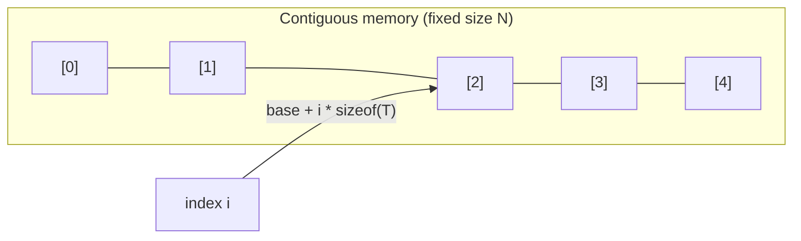
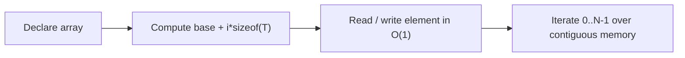

# Array

## Concept

An array is a fixed-size, contiguous block of memory holding elements of the same type, laid out one after another. Because the storage is contiguous, the address of element `i` is `base + i * sizeof(T)`, so any element can be read or written in constant time by index. The size is fixed at compile time (for a C array or `std::array<T, N>`), which means you cannot grow or shrink it. Arrays excel when you know the element count up front and want zero-overhead, cache-friendly random access. They are a poor fit when you must insert or remove in the middle, since that requires shifting all subsequent elements.

## Mermaid



## Complexity

| Operation            | Time   | Notes                                        |
|----------------------|--------|----------------------------------------------|
| Access by index      | O(1)   | direct address arithmetic                    |
| Search (unsorted)    | O(n)   | must scan; O(log n) if sorted + binary search|
| Insert at end        | n/a    | fixed size; cannot grow                       |
| Insert/delete middle | O(n)   | requires shifting elements (size fixed)       |

- Space: O(n) for n elements, no per-element overhead.

## C++11 Code

```cpp
#include <array>
#include <iostream>
using namespace std;

int main() {
    // std::array is a fixed-size array (size known at compile time).
    array<int, 5> a = {10, 20, 30, 40, 50};

    // O(1) random access by index.
    int third = a[2];                 // 30
    a[2] = 99;                        // overwrite in place, O(1)

    // .at() does bounds-checked access (throws std::out_of_range).
    int safe = a.at(0);               // 10

    // size() is a compile-time constant for std::array.
    size_t n = a.size();              // 5

    // Iterate over contiguous storage.
    for (size_t i = 0; i < n; ++i) {
        cout << a[i] << ' ';          // 10 20 99 40 50
    }
    cout << '\n' << "third=" << third << " safe=" << safe << '\n';
    return 0;
}
```

## Mini Usage Example

```cpp
array<int, 4> data = {4, 2, 8, 1};
data[1] = 7;                 // O(1) update -> {4, 7, 8, 1}
int x = data.at(3);          // bounds-checked read -> 1
(void)x;
```

## Code Snippet Flow


