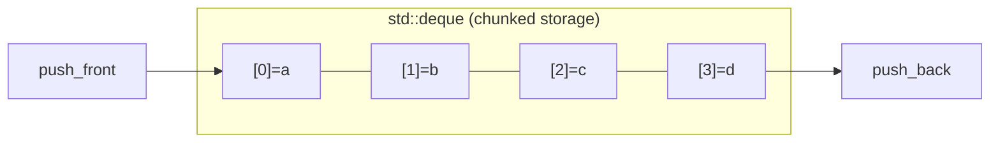
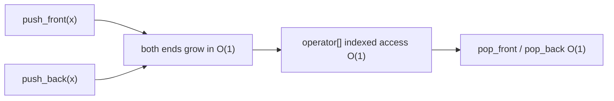

# Deque

## Concept

A deque (double-ended queue, pronounced "deck") is a sequence container that supports fast insertion and removal at both the front and the back in amortized O(1). Internally `std::deque` is not a single contiguous block; it is typically a sequence of fixed-size chunks tracked by a map of chunk pointers, which is why it can grow at either end without shifting all elements. It still offers O(1) random access by index (with a small extra indirection compared to a vector). Choose a deque when you need queue-like behavior at both ends plus indexed access; it is the default backing store for `std::stack` and `std::queue`.

## Mermaid



## Complexity

| Operation                | Time           | Notes                              |
|--------------------------|----------------|------------------------------------|
| Access by index          | O(1)           | extra indirection vs vector        |
| push_front / push_back   | amortized O(1) | grows at either end, no full shift |
| pop_front / pop_back     | O(1)           | removes at either end              |
| Insert/erase middle      | O(n)           | shifts toward nearer end           |

- Space: O(n), with some slack in the per-end chunks.

## C++11 Code

```cpp
#include <deque>
#include <iostream>
using namespace std;

int main() {
    deque<int> d;

    d.push_back(20);           // [20]
    d.push_back(30);           // [20, 30]
    d.push_front(10);          // [10, 20, 30]  -- O(1) at the front
    d.push_front(5);           // [5, 10, 20, 30]

    cout << "front=" << d.front() << " back=" << d.back() << '\n';  // 5, 30
    cout << "d[2]=" << d[2] << '\n';      // 20 -- O(1) indexed access

    d.pop_front();             // [10, 20, 30]
    d.pop_back();              // [10, 20]

    for (int x : d) cout << x << ' ';     // 10 20
    cout << "\nsize=" << d.size() << '\n';
    return 0;
}
```

## Mini Usage Example

```cpp
deque<int> window;
window.push_back(1);
window.push_back(2);
window.push_front(0);   // {0, 1, 2}
window.pop_back();      // {0, 1}  -- cheap at both ends
```

## Code Snippet Flow


