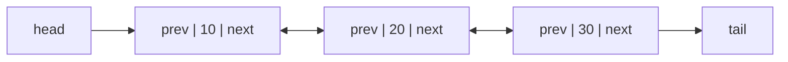
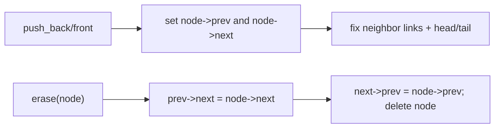

# Doubly Linked List

## Concept

A doubly linked list is a chain of nodes where each node stores a value plus two pointers: one to the next node and one to the previous node. The two-way links let you traverse in either direction and, crucially, remove a node in O(1) given only a pointer to that node, because you can reach both of its neighbors directly. The list keeps a head and a tail pointer, so insertion at either end is O(1). The cost over a singly linked list is an extra pointer per node and a little more bookkeeping when rewiring. This is the structure behind `std::list` and is ideal when you insert/erase at both ends or at arbitrary held positions.

## Mermaid



## Complexity

| Operation                | Time | Notes                                       |
|--------------------------|------|---------------------------------------------|
| Access / search by value | O(n) | traverse from head or tail                   |
| Insert at front or back  | O(1) | head/tail pointers maintained               |
| Insert before/after node | O(1) | rewire prev/next of neighbors               |
| Delete a known node      | O(1) | both neighbors reachable directly           |

- Space: O(n) values plus two pointers of overhead per node.

## C++11 Code

```cpp
#include <iostream>
using namespace std;

struct Node {
    int value;
    Node* prev;
    Node* next;
    Node(int v) : value(v), prev(nullptr), next(nullptr) {}
};

class DoublyLinkedList {
    Node* head;
    Node* tail;
public:
    DoublyLinkedList() : head(nullptr), tail(nullptr) {}

    ~DoublyLinkedList() {
        while (head) { Node* n = head->next; delete head; head = n; }
    }

    // Append at the back: O(1).
    void push_back(int v) {
        Node* n = new Node(v);
        n->prev = tail;
        if (tail) tail->next = n; else head = n;   // link old tail or set head
        tail = n;
    }

    // Prepend at the front: O(1).
    void push_front(int v) {
        Node* n = new Node(v);
        n->next = head;
        if (head) head->prev = n; else tail = n;
        head = n;
    }

    // Remove a node we already hold: O(1) (no traversal needed).
    void erase(Node* n) {
        if (!n) return;
        if (n->prev) n->prev->next = n->next; else head = n->next;
        if (n->next) n->next->prev = n->prev; else tail = n->prev;
        delete n;
    }

    Node* find(int v) const {
        for (Node* cur = head; cur; cur = cur->next)
            if (cur->value == v) return cur;
        return nullptr;
    }

    void print() const {
        for (Node* cur = head; cur; cur = cur->next) cout << cur->value << " <-> ";
        cout << "null\n";
    }
};

int main() {
    DoublyLinkedList list;
    list.push_back(20);
    list.push_back(30);
    list.push_front(10);     // 10 <-> 20 <-> 30
    list.erase(list.find(20));   // 10 <-> 30  (O(1) unlink)
    list.print();
    return 0;
}
```

## Mini Usage Example

```cpp
DoublyLinkedList list;
list.push_back(1);
list.push_front(0);      // 0 <-> 1
Node* mid = list.find(1);
list.erase(mid);         // 0   (O(1) removal of a held node)
```

## Code Snippet Flow


