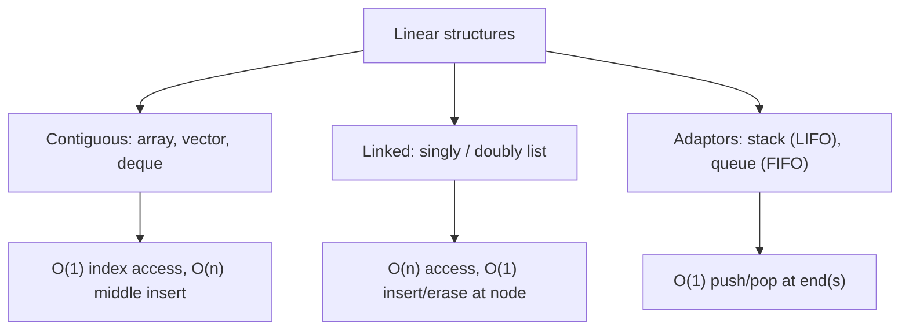
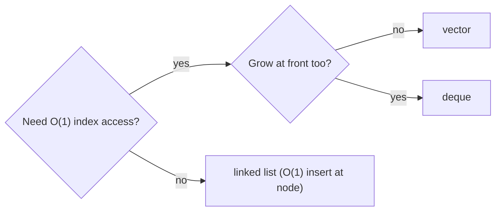

# Linear Complexity Table

## Concept

This reference compares the linear (sequence) data structures from this chapter so you can pick the right one by its operation costs. The fundamental trade-off is contiguous storage (arrays, vectors, deques) versus linked nodes (linked lists). Contiguous containers give O(1) indexed access but pay O(n) to insert or erase in the middle; linked structures give O(1) insertion/removal at a held node but O(n) access. Adaptors (stack, queue) restrict the interface to O(1) end operations. Use this table to match access patterns to the cheapest structure.

## Mermaid



## Complexity

| Structure          | Access | Search | Insert (front) | Insert (back)   | Insert (middle) | Delete (middle) | Notes                                  |
|--------------------|--------|--------|----------------|-----------------|-----------------|-----------------|----------------------------------------|
| Array (fixed)      | O(1)   | O(n)   | n/a            | n/a             | O(n)            | O(n)            | fixed size; no growth                  |
| Vector             | O(1)   | O(n)   | O(n)           | amortized O(1)  | O(n)            | O(n)            | contiguous; geometric growth           |
| Deque              | O(1)   | O(n)   | amortized O(1) | amortized O(1)  | O(n)            | O(n)            | fast at both ends; chunked storage     |
| Singly linked list | O(n)   | O(n)   | O(1)           | O(1) w/ tail ptr| O(1) at node    | O(1) at node    | find is O(n); 1 pointer/node           |
| Doubly linked list | O(n)   | O(n)   | O(1)           | O(1)            | O(1) at node    | O(1) at node    | bidirectional; 2 pointers/node         |
| Stack (adaptor)    | O(1)*  | O(n)   | --             | O(1) push       | --              | O(1) pop top    | *top only; LIFO                        |
| Queue (adaptor)    | O(1)*  | O(n)   | O(1) pop front | O(1) push back  | --              | --              | *front/back only; FIFO                 |

- Space: all O(n); linked lists add per-node pointer overhead.

## C++11 Code

```cpp
// Picking a structure by access pattern:
#include <vector>
#include <deque>
#include <list>
#include <stack>
#include <queue>
using namespace std;

void chooseByPattern() {
    vector<int> v;   // need indexed access + grow at the end
    deque<int>  d;   // need fast push/pop at BOTH ends + indexing
    list<int>   l;   // need O(1) insert/erase at arbitrary held positions
    stack<int>  s;   // need strict LIFO
    queue<int>  q;   // need strict FIFO
    (void)v; (void)d; (void)l; (void)s; (void)q;
}
```

## Mini Usage Example

```cpp
// "Many middle inserts at known iterators?" -> std::list (O(1) at node).
// "Random index reads, append-heavy?"      -> std::vector (O(1) access).
// "Sliding window from both ends?"          -> std::deque.
```

## Code Snippet Flow


