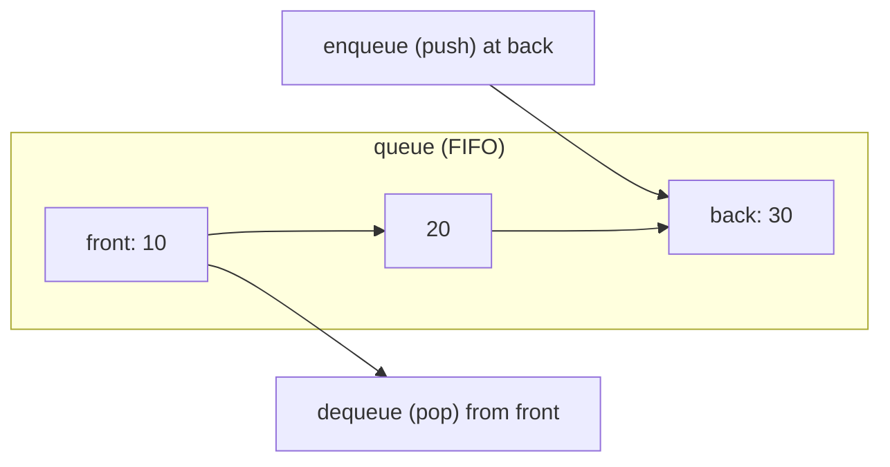
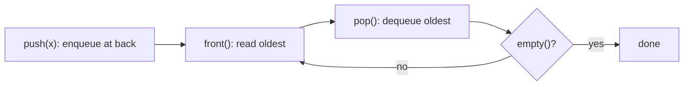

# Queue

## Concept

A queue is a FIFO (first-in, first-out) container: elements leave in the same order they arrived. You enqueue at the back (push) and dequeue from the front (pop), and you can inspect both ends with front and back, all in O(1). In C++ `std::queue` is a container adaptor that wraps an underlying sequence (default `std::deque`) and exposes only the FIFO interface. Queues model order-preserving pipelines: task schedulers, message buffers, and breadth-first traversal.

## Mermaid



## Complexity

| Operation     | Time | Notes                         |
|---------------|------|-------------------------------|
| push (enqueue)| O(1) | adds at back                  |
| pop (dequeue) | O(1) | removes from front            |
| front / back  | O(1) | inspect either end            |
| search        | O(n) | not a queue operation         |

- Space: O(n) for n elements.

## C++11 Code

```cpp
#include <queue>
#include <iostream>
using namespace std;

int main() {
    queue<int> q;              // FIFO adaptor over std::deque by default

    q.push(10);                // back -> [10]
    q.push(20);                // [10, 20]
    q.push(30);                // [10, 20, 30]

    cout << "front=" << q.front() << '\n';   // 10 (oldest)
    cout << "back="  << q.back()  << '\n';   // 30 (newest)

    q.pop();                   // remove front (10) -> [20, 30]
    cout << "front=" << q.front() << '\n';   // 20

    // Drain in FIFO order: prints 20 then 30.
    while (!q.empty()) {
        cout << q.front() << ' ';
        q.pop();
    }
    cout << "\nsize=" << q.size() << '\n';   // 0
    return 0;
}
```

## Mini Usage Example

```cpp
queue<string> tasks;
tasks.push("build");
tasks.push("test");
string next = tasks.front();   // "build" (arrived first)
tasks.pop();                   // now front is "test"
(void)next;
```

## Code Snippet Flow


