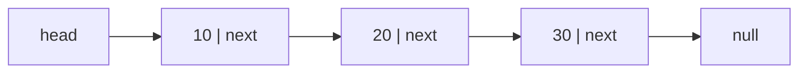
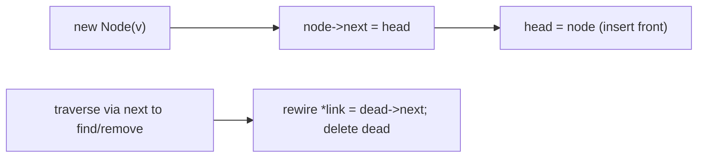

# Singly Linked List

## Concept

A singly linked list stores elements in separately allocated nodes, where each node holds a value and a pointer to the next node; the last node points to null. Unlike an array the nodes are not contiguous, so there is no index arithmetic and reaching the i-th element requires walking the chain (O(n)). The payoff is O(1) insertion and deletion once you already hold a pointer to the relevant node, with no element shifting. A head pointer marks the front of the list. Use it when you frequently insert or remove at the front (or at a known node) and rarely need random access.

## Mermaid



## Complexity

| Operation              | Time   | Notes                                          |
|------------------------|--------|------------------------------------------------|
| Access / search by value | O(n) | must traverse from head                        |
| Insert at front        | O(1)   | new node points to old head                    |
| Insert after known node| O(1)   | rewire two next pointers                        |
| Delete known/front node| O(1)   | (finding the node is O(n))                      |

- Space: O(n) values plus one pointer of overhead per node.

## C++11 Code

```cpp
#include <iostream>
using namespace std;

// A node holds a value and a pointer to the next node.
struct Node {
    int value;
    Node* next;
    Node(int v) : value(v), next(nullptr) {}
};

class SinglyLinkedList {
    Node* head;
public:
    SinglyLinkedList() : head(nullptr) {}

    ~SinglyLinkedList() {                 // free every node
        while (head) { Node* n = head->next; delete head; head = n; }
    }

    // Insert at the front: O(1).
    void push_front(int v) {
        Node* n = new Node(v);
        n->next = head;                   // new node points to old head
        head = n;                         // head now points to new node
    }

    // Find first node with a given value: O(n).
    Node* find(int v) const {
        for (Node* cur = head; cur; cur = cur->next)
            if (cur->value == v) return cur;
        return nullptr;
    }

    // Remove first node equal to v: O(n) to find, O(1) to unlink.
    bool remove(int v) {
        Node** link = &head;              // pointer to the pointer we may rewire
        while (*link) {
            if ((*link)->value == v) {
                Node* dead = *link;
                *link = dead->next;       // unlink
                delete dead;
                return true;
            }
            link = &(*link)->next;
        }
        return false;
    }

    void print() const {
        for (Node* cur = head; cur; cur = cur->next) cout << cur->value << " -> ";
        cout << "null\n";
    }
};

int main() {
    SinglyLinkedList list;
    list.push_front(30);
    list.push_front(20);
    list.push_front(10);     // 10 -> 20 -> 30 -> null
    list.remove(20);         // 10 -> 30 -> null
    list.print();
    cout << (list.find(30) ? "found 30\n" : "missing\n");
    return 0;
}
```

## Mini Usage Example

```cpp
SinglyLinkedList list;
list.push_front(5);      // 5 -> null
list.push_front(7);      // 7 -> 5 -> null
bool removed = list.remove(5);  // 7 -> null, removed == true
(void)removed;
```

## Code Snippet Flow


