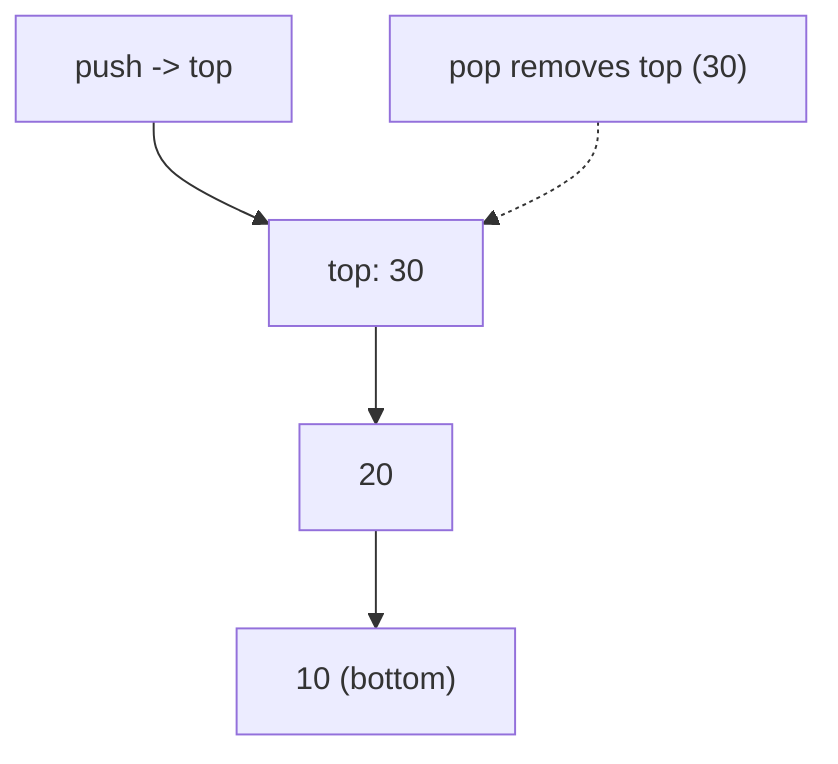
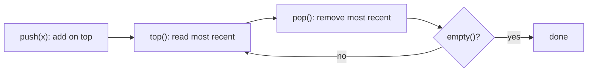

# Stack

## Concept

A stack is a LIFO (last-in, first-out) container: the only element you can read or remove is the one most recently added (the top). Its three core operations are push (add on top), pop (remove the top), and top/peek (inspect the top), all in O(1). In C++ `std::stack` is a container adaptor that wraps an underlying sequence (by default `std::deque`) and exposes only the LIFO interface. Stacks model anything with nested or reversed order: function call frames, undo histories, expression evaluation, and depth-first traversal.

## Mermaid



## Complexity

| Operation   | Time | Notes                          |
|-------------|------|--------------------------------|
| push        | O(1) | amortized (adds to top)        |
| pop         | O(1) | removes top                    |
| top / peek  | O(1) | reads top without removing     |
| search      | O(n) | not a stack operation by design|

- Space: O(n) for n elements.

## C++11 Code

```cpp
#include <stack>
#include <iostream>
using namespace std;

int main() {
    stack<int> s;              // LIFO adaptor over std::deque by default

    s.push(10);                // [10]
    s.push(20);                // [10, 20]
    s.push(30);                // [10, 20, 30]  (30 on top)

    cout << "top=" << s.top() << '\n';   // 30 (peek, no removal)

    s.pop();                   // remove 30 -> [10, 20]
    cout << "top=" << s.top() << '\n';   // 20

    // Drain the stack in LIFO order: prints 20 then 10.
    while (!s.empty()) {
        cout << s.top() << ' ';
        s.pop();
    }
    cout << "\nsize=" << s.size() << '\n';   // 0
    return 0;
}
```

## Mini Usage Example

```cpp
stack<char> s;
s.push('a');
s.push('b');
char t = s.top();   // 'b' (most recent)
s.pop();            // back to {'a'}
(void)t;
```

## Code Snippet Flow


