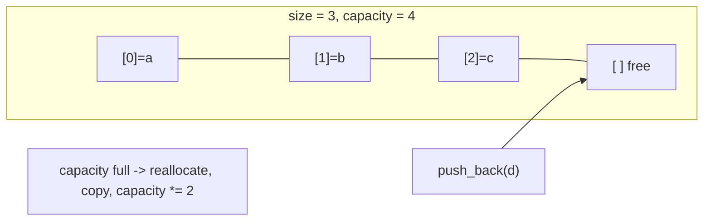
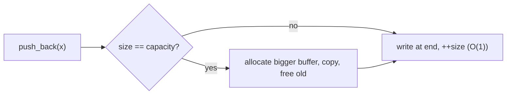

# Vector

## Concept

`std::vector` is a dynamic array: a contiguous, resizable buffer that grows automatically as you append elements. Like a plain array it gives O(1) random access by index, but it also owns its memory and can reallocate to a larger block when it runs out of capacity. To keep appends cheap, it grows its capacity geometrically (typically doubling), which makes `push_back` amortized O(1) even though an individual reallocation copies all elements. Inserting or erasing in the middle is O(n) because the tail must be shifted. Use a vector as your default sequence container whenever you need indexed access plus the ability to grow.

## Mermaid



## Complexity

| Operation              | Time            | Notes                                       |
|------------------------|-----------------|---------------------------------------------|
| Access by index        | O(1)            | contiguous storage                          |
| Search (unsorted)      | O(n)            | linear scan                                 |
| push_back / pop_back    | amortized O(1)  | occasional O(n) reallocation, geometric grow|
| Insert/erase middle    | O(n)            | shifts trailing elements                    |

- Space: O(n); capacity may exceed size, so some slack memory is reserved.

## C++11 Code

```cpp
#include <vector>
#include <iostream>
using namespace std;

int main() {
    vector<int> v;
    v.reserve(8);              // pre-allocate capacity to avoid reallocations

    v.push_back(10);           // append at end, amortized O(1)
    v.push_back(20);
    v.push_back(30);           // v = {10, 20, 30}

    v[0] = 11;                 // O(1) indexed update -> {11, 20, 30}

    // Insert in the middle: O(n), shifts later elements right.
    v.insert(v.begin() + 1, 15);   // {11, 15, 20, 30}

    // Erase from the middle: O(n), shifts later elements left.
    v.erase(v.begin() + 2);        // {11, 15, 30}

    v.pop_back();                  // remove last, O(1) -> {11, 15}

    cout << "front=" << v.front() << " back=" << v.back() << '\n';
    cout << "size=" << v.size() << " capacity=" << v.capacity() << '\n';
    for (int x : v) cout << x << ' ';   // 11 15
    cout << '\n';
    return 0;
}
```

## Mini Usage Example

```cpp
vector<int> data = {4, 2, 8, 1};
data.push_back(9);            // {4, 2, 8, 1, 9}
data.insert(data.begin(), 0); // {0, 4, 2, 8, 1, 9}, O(n)
int n = (int)data.size();     // 6
(void)n;
```

## Code Snippet Flow


