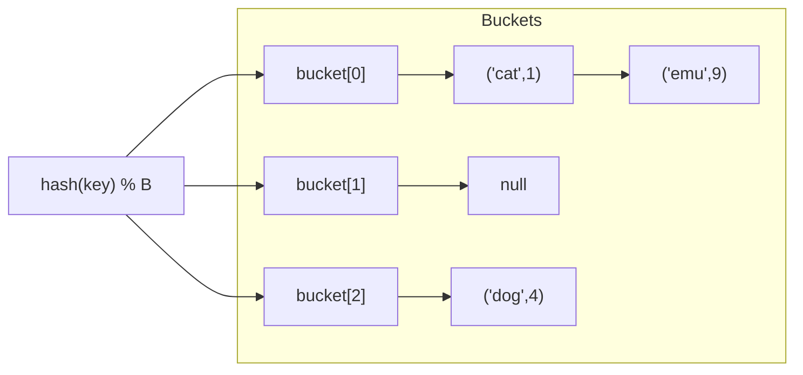
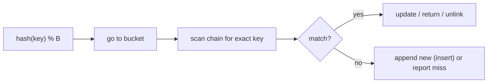

# Hash Table Chaining

## Concept

A hash table with separate chaining stores key-value pairs in an array of buckets, where a hash function maps each key to a bucket index. When two keys hash to the same bucket (a collision), they are stored together in a per-bucket linked list (the "chain"). Lookup hashes the key to find its bucket, then scans that short chain for an exact match. With a good hash function and a bounded load factor (entries / buckets), chains stay short and search, insert, and delete are all average O(1); the worst case degrades to O(n) if every key lands in one bucket. Chaining handles high load factors gracefully and never "fills up." Use it as a general-purpose associative store.

## Mermaid



## Complexity

| Operation | Average | Worst | Notes                                  |
|-----------|---------|-------|----------------------------------------|
| Search    | O(1)    | O(n)  | O(1 + load factor) expected            |
| Insert    | O(1)    | O(n)  | prepend to bucket chain                 |
| Delete    | O(1)    | O(n)  | scan chain, unlink node                 |

- Space: O(n + B) for n entries and B buckets.

## C++11 Code

```cpp
#include <vector>
#include <list>
#include <string>
#include <utility>
#include <iostream>
using namespace std;

// Separate-chaining hash table: array of buckets, each a list of (key,value).
class HashTable {
    vector<list<pair<string,int>>> buckets;
    size_t count;

    size_t indexFor(const string& key) const {
        return std::hash<string>()(key) % buckets.size();   // map key -> bucket
    }
public:
    explicit HashTable(size_t b = 8) : buckets(b), count(0) {}

    // Insert or update: O(1) average.
    void put(const string& key, int value) {
        auto& chain = buckets[indexFor(key)];
        for (auto& kv : chain) {
            if (kv.first == key) { kv.second = value; return; }   // update
        }
        chain.push_back(make_pair(key, value));                   // new key
        ++count;
    }

    // Lookup: hash to bucket, scan its chain. O(1) average.
    bool get(const string& key, int& out) const {
        const auto& chain = buckets[indexFor(key)];
        for (const auto& kv : chain) {
            if (kv.first == key) { out = kv.second; return true; }
        }
        return false;
    }

    // Delete: unlink the matching node from its chain. O(1) average.
    bool erase(const string& key) {
        auto& chain = buckets[indexFor(key)];
        for (auto it = chain.begin(); it != chain.end(); ++it) {
            if (it->first == key) { chain.erase(it); --count; return true; }
        }
        return false;
    }

    size_t size() const { return count; }
};

int main() {
    HashTable t;
    t.put("cat", 1);
    t.put("dog", 4);
    t.put("cat", 7);          // updates existing key

    int v;
    if (t.get("cat", v)) cout << "cat=" << v << '\n';   // cat=7
    t.erase("dog");
    cout << "size=" << t.size() << '\n';                // 1
    return 0;
}
```

## Mini Usage Example

```cpp
HashTable counts;
counts.put("apple", 3);
int n;
bool found = counts.get("apple", n);   // found == true, n == 3
(void)found;
```

## Code Snippet Flow


