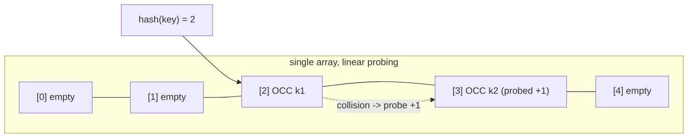
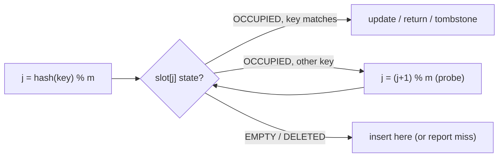

# Hash Table Open Addressing

## Concept

In an open-addressing hash table all entries live directly in a single array; there are no per-bucket lists. When a key's home slot (its hash index) is already taken, the table probes a deterministic sequence of other slots until it finds an empty one to insert into, or finds the key when searching. The simplest scheme is linear probing: step to the next slot (index + 1, wrapping around). Each slot is tagged EMPTY, OCCUPIED, or DELETED; the DELETED tombstone is essential so that lookups can probe past a removed entry without stopping early. Open addressing is cache-friendly and compact but must keep its load factor low (resize before it fills) or probe sequences grow long, degrading toward O(n).

## Mermaid



## Complexity

| Operation | Average | Worst | Notes                                       |
|-----------|---------|-------|---------------------------------------------|
| Search    | O(1)    | O(n)  | depends on load factor and clustering        |
| Insert    | O(1)    | O(n)  | probe until empty/deleted slot              |
| Delete    | O(1)    | O(n)  | mark tombstone (DELETED), not EMPTY         |

- Space: O(m) where m is the table capacity; keep load factor (n/m) well below 1.

## C++11 Code

```cpp
#include <vector>
#include <string>
#include <iostream>
using namespace std;

// Open-addressing hash table with linear probing and tombstones.
class HashTable {
    enum State { EMPTY, OCCUPIED, DELETED };
    struct Slot { string key; int value; State state; Slot() : value(0), state(EMPTY) {} };

    vector<Slot> slots;
    size_t count;

    size_t home(const string& key) const {
        return std::hash<string>()(key) % slots.size();
    }
public:
    explicit HashTable(size_t cap = 8) : slots(cap), count(0) {}

    // Insert or update. Probes linearly past OCCUPIED slots.
    void put(const string& key, int value) {
        size_t i = home(key);
        for (size_t step = 0; step < slots.size(); ++step) {
            size_t j = (i + step) % slots.size();        // linear probe
            if (slots[j].state == OCCUPIED) {
                if (slots[j].key == key) { slots[j].value = value; return; }  // update
            } else {                                     // EMPTY or DELETED -> reuse
                slots[j].key = key;
                slots[j].value = value;
                slots[j].state = OCCUPIED;
                ++count;
                return;
            }
        }
        // Table full: a real implementation would rehash into a larger array here.
    }

    // Lookup: probe until we find the key or hit a truly EMPTY slot.
    bool get(const string& key, int& out) const {
        size_t i = home(key);
        for (size_t step = 0; step < slots.size(); ++step) {
            size_t j = (i + step) % slots.size();
            if (slots[j].state == EMPTY) return false;   // stop: never inserted past here
            if (slots[j].state == OCCUPIED && slots[j].key == key) {
                out = slots[j].value; return true;
            }
            // DELETED -> keep probing (tombstone)
        }
        return false;
    }

    // Delete: mark a tombstone so later probes don't terminate early.
    bool erase(const string& key) {
        size_t i = home(key);
        for (size_t step = 0; step < slots.size(); ++step) {
            size_t j = (i + step) % slots.size();
            if (slots[j].state == EMPTY) return false;
            if (slots[j].state == OCCUPIED && slots[j].key == key) {
                slots[j].state = DELETED; --count; return true;
            }
        }
        return false;
    }

    size_t size() const { return count; }
};

int main() {
    HashTable t(8);
    t.put("cat", 1);
    t.put("dog", 4);
    t.put("cat", 7);          // updates in place

    int v;
    if (t.get("cat", v)) cout << "cat=" << v << '\n';   // cat=7
    t.erase("dog");
    cout << "found dog? " << (t.get("dog", v) ? "yes" : "no") << '\n';  // no
    cout << "size=" << t.size() << '\n';                // 1
    return 0;
}
```

## Mini Usage Example

```cpp
HashTable t(16);
t.put("x", 42);
int v;
bool ok = t.get("x", v);   // ok == true, v == 42
t.erase("x");              // leaves a DELETED tombstone
(void)ok;
```

## Code Snippet Flow


