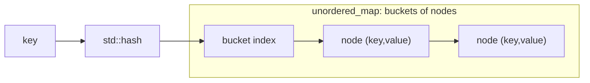
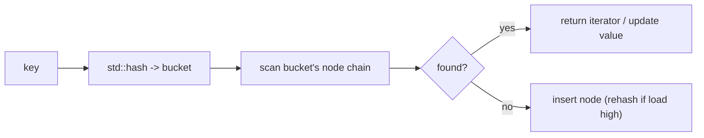

# Unordered Map / Unordered Set

## Concept

`std::unordered_map` and `std::unordered_set` are the C++ standard library's hash-based associative containers, introduced in C++11. `unordered_set<K>` stores unique keys; `unordered_map<K,V>` stores unique keys each mapped to a value. Both implement separate chaining internally (an array of buckets holding nodes), so search, insert, and erase are average O(1) and worst-case O(n). Elements are stored in no particular order, which is the trade-off for hashing speed compared to the tree-based `std::map`/`std::set` (ordered, O(log n)). They rehash automatically as the load factor grows. Reach for these whenever you need fast membership tests or key-to-value lookups and do not need sorted iteration.

## Mermaid



## Complexity

| Operation        | Average | Worst | Notes                                  |
|------------------|---------|-------|----------------------------------------|
| find / count     | O(1)    | O(n)  | hash to bucket, scan chain             |
| insert / emplace | O(1)    | O(n)  | amortized; may trigger a rehash         |
| erase            | O(1)    | O(n)  | by key or by iterator                  |
| iteration        | O(n)    | O(n)  | unspecified order                      |

- Space: O(n) plus bucket array overhead.

## C++11 Code

```cpp
#include <unordered_map>
#include <unordered_set>
#include <string>
#include <iostream>
using namespace std;

int main() {
    // unordered_map: key -> value, average O(1) operations.
    unordered_map<string, int> ages;
    ages["alice"] = 30;                 // insert via operator[]
    ages.insert(make_pair("bob", 25));  // insert via pair
    ages["alice"] = 31;                 // update existing key

    auto it = ages.find("bob");         // O(1) average lookup
    if (it != ages.end())
        cout << it->first << "=" << it->second << '\n';   // bob=25

    ages.erase("bob");                  // remove by key
    cout << "count alice=" << ages.count("alice") << '\n'; // 1

    // unordered_set: unique membership, average O(1) contains-check.
    unordered_set<int> seen;
    seen.insert(10);
    seen.insert(10);                    // duplicate ignored
    seen.insert(20);
    cout << "size=" << seen.size() << '\n';                // 2
    cout << "has 10? " << (seen.count(10) ? "yes" : "no") << '\n'; // yes
    return 0;
}
```

## Mini Usage Example

```cpp
unordered_map<string, int> freq;
for (const string& w : {"a", "b", "a"})
    ++freq[w];               // freq["a"] == 2, freq["b"] == 1

unordered_set<int> ids = {1, 2, 3};
bool present = ids.count(2) > 0;   // true
(void)present;
```

## Code Snippet Flow


