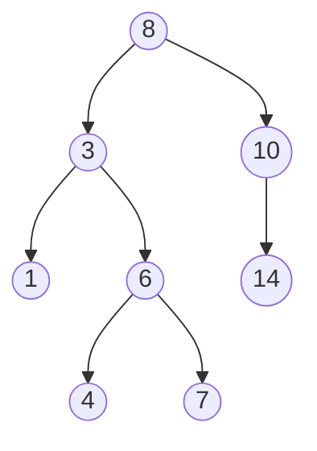
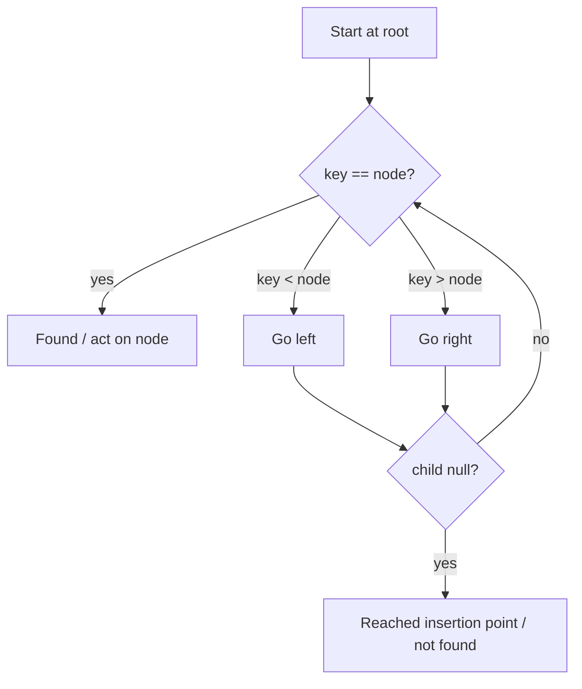

# Binary Search Tree

## Concept

A binary search tree (BST) is a binary tree that maintains a strict ordering invariant: for every node, all keys in its left subtree are smaller and all keys in its right subtree are larger. This ordering lets you locate, insert, or remove a key by walking down a single root-to-leaf path, comparing at each step. An inorder traversal of a BST therefore yields the keys in sorted order. BSTs are ideal when you need an ordered collection with reasonably fast lookup, insertion, and deletion, but note that without balancing the tree can degrade to a linked list.

## Mermaid



## Complexity

- Search / Insert / Delete: O(log n) average on a balanced tree, O(h) in general
- Worst case (degenerate / sorted insertion order): O(n) per operation, since the tree becomes a chain
- Inorder traversal: O(n)
- Space: O(n) for storage, O(h) recursion depth

## C++11 Code

```cpp
#include <iostream>
using namespace std;

struct Node {
    int key;
    Node* left;
    Node* right;
    Node(int k) : key(k), left(nullptr), right(nullptr) {}
};

// Insert returns the (possibly new) subtree root.
Node* insert(Node* root, int key) {
    if (!root) return new Node(key);
    if (key < root->key)      root->left  = insert(root->left, key);
    else if (key > root->key) root->right = insert(root->right, key);
    // equal keys are ignored (set semantics)
    return root;
}

// Search returns the node holding key, or nullptr.
Node* search(Node* root, int key) {
    while (root && root->key != key)
        root = (key < root->key) ? root->left : root->right;
    return root;
}

// Leftmost node = smallest key in a subtree.
Node* findMin(Node* root) {
    while (root && root->left) root = root->left;
    return root;
}

// Delete using the inorder successor when the node has two children.
Node* removeNode(Node* root, int key) {
    if (!root) return nullptr;
    if (key < root->key) {
        root->left = removeNode(root->left, key);
    } else if (key > root->key) {
        root->right = removeNode(root->right, key);
    } else {
        // Found it. Handle 0 or 1 child first.
        if (!root->left)  { Node* r = root->right; delete root; return r; }
        if (!root->right) { Node* l = root->left;  delete root; return l; }
        // Two children: copy successor key, then delete successor.
        Node* succ = findMin(root->right);
        root->key = succ->key;
        root->right = removeNode(root->right, succ->key);
    }
    return root;
}
```

## Mini Usage Example

```cpp
Node* root = nullptr;
int keys[] = {8, 3, 10, 1, 6, 14, 4, 7};
for (int k : keys) root = insert(root, k);

cout << (search(root, 6) ? "found" : "missing") << '\n';  // found
root = removeNode(root, 3);   // remove node with two children
cout << (search(root, 3) ? "found" : "missing") << '\n';  // missing
```

## Code Snippet Flow


