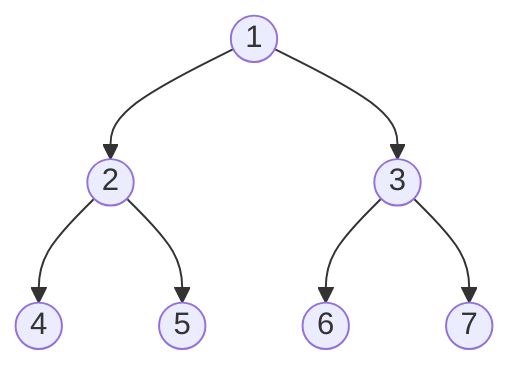
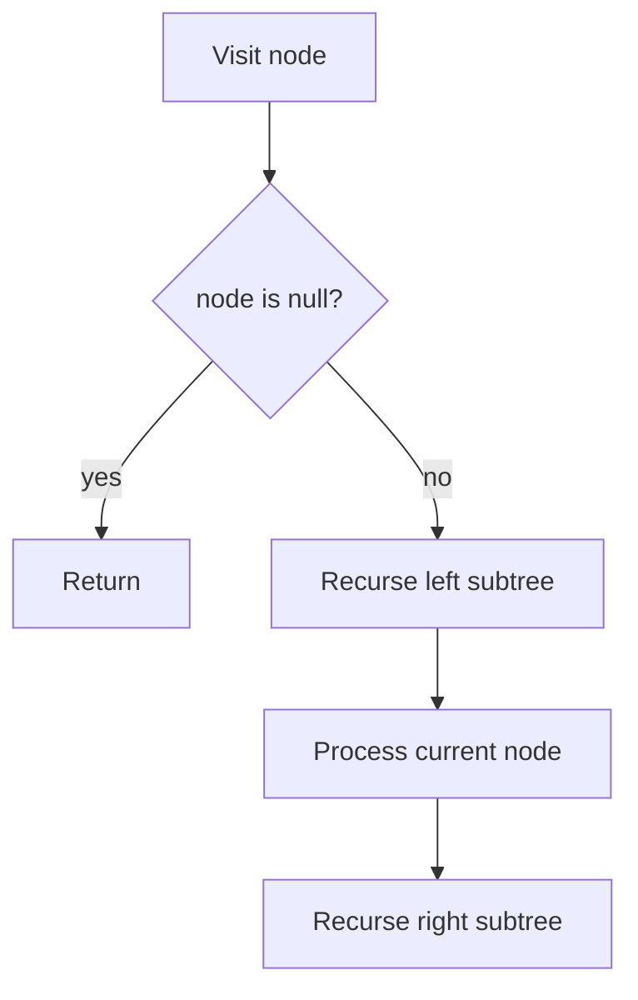

# Binary Tree

## Concept

A binary tree is a hierarchical structure where each node holds a value and has at most two children, conventionally called `left` and `right`. Unlike a binary *search* tree, a plain binary tree imposes no ordering on the values; the only invariant is the at-most-two-children shape. It is the foundation for many specialized trees (BST, heap, expression trees) and is most naturally traversed recursively. The four classic traversals are inorder (left, node, right), preorder (node, left, right), postorder (left, right, node), and level-order (breadth-first by depth).

## Mermaid



## Complexity

- Traversal (inorder / preorder / postorder / level-order): O(n) time, visiting every node once
- Recursive traversal space: O(h) for the call stack, where h is the height (O(n) worst case for a skewed tree, O(log n) when balanced)
- Level-order space: O(w) for the queue, where w is the maximum width of the tree

## C++11 Code

```cpp
#include <iostream>
#include <queue>
using namespace std;

// A node owns its two child subtrees.
struct Node {
    int val;
    Node* left;
    Node* right;
    Node(int v) : val(v), left(nullptr), right(nullptr) {}
};

// Left, Node, Right
void inorder(Node* root) {
    if (!root) return;
    inorder(root->left);
    cout << root->val << ' ';
    inorder(root->right);
}

// Node, Left, Right
void preorder(Node* root) {
    if (!root) return;
    cout << root->val << ' ';
    preorder(root->left);
    preorder(root->right);
}

// Left, Right, Node
void postorder(Node* root) {
    if (!root) return;
    postorder(root->left);
    postorder(root->right);
    cout << root->val << ' ';
}

// Breadth-first, level by level, using a queue.
void levelOrder(Node* root) {
    if (!root) return;
    queue<Node*> q;
    q.push(root);
    while (!q.empty()) {
        Node* cur = q.front();
        q.pop();
        cout << cur->val << ' ';
        if (cur->left)  q.push(cur->left);
        if (cur->right) q.push(cur->right);
    }
}
```

## Mini Usage Example

```cpp
//        1
//       / \
//      2   3
//     / \
//    4   5
Node* root = new Node(1);
root->left = new Node(2);
root->right = new Node(3);
root->left->left = new Node(4);
root->left->right = new Node(5);

inorder(root);    cout << '\n';   // 4 2 5 1 3
preorder(root);   cout << '\n';   // 1 2 4 5 3
postorder(root);  cout << '\n';   // 4 5 2 3 1
levelOrder(root); cout << '\n';   // 1 2 3 4 5
```

## Code Snippet Flow


