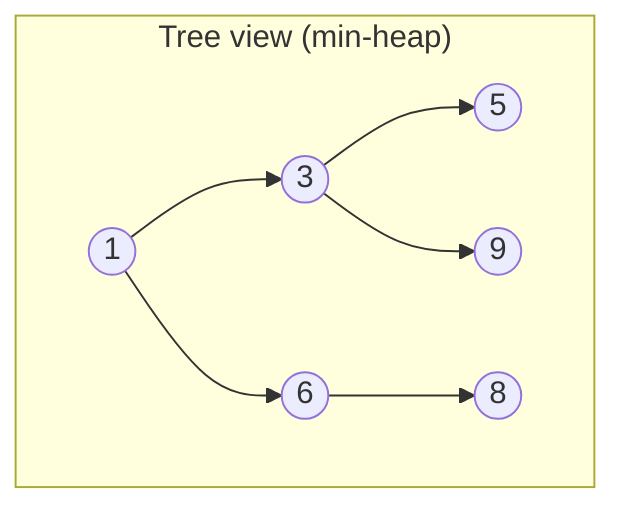
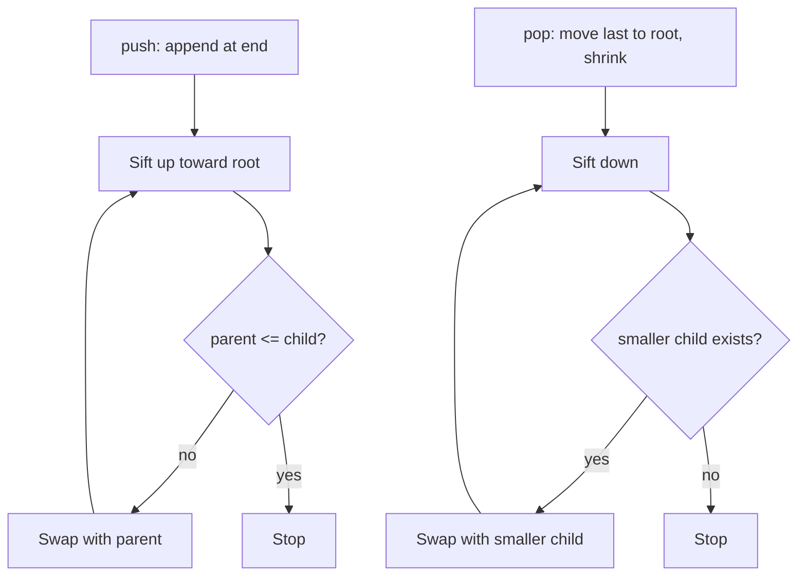

# Heap

## Concept

A binary heap is a complete binary tree stored compactly in an array, satisfying the heap property: in a min-heap every parent is less than or equal to its children (a max-heap reverses the comparison). Because the tree is complete, the children of index `i` live at `2i+1` and `2i+2`, and the parent at `(i-1)/2`, so no pointers are needed. The minimum (or maximum) element is always at the root, retrievable in O(1), while insertions sift a new element up and removals sift the moved last element down to restore the property. Heaps are the engine behind priority queues and heapsort.

## Mermaid



Array layout: `[1, 3, 6, 5, 9, 8]` — index 0 is the root; child(i) = 2i+1, 2i+2.

## Complexity

- Peek (top): O(1)
- Push (insert + sift-up): O(log n)
- Pop (remove top + sift-down): O(log n)
- Build heap from n elements: O(n)
- Space: O(n)

## C++11 Code

```cpp
#include <vector>
#include <utility>
using namespace std;

// Array-based min-heap.
struct MinHeap {
    vector<int> a;

    void push(int x) {
        a.push_back(x);
        int i = (int)a.size() - 1;
        // Sift up: swap with parent while smaller than it.
        while (i > 0) {
            int parent = (i - 1) / 2;
            if (a[parent] <= a[i]) break;
            swap(a[parent], a[i]);
            i = parent;
        }
    }

    int top() const { return a.front(); }  // smallest element

    void pop() {
        a.front() = a.back();   // move last element to root
        a.pop_back();
        int i = 0, n = (int)a.size();
        // Sift down: swap with the smaller child while it violates the order.
        while (true) {
            int l = 2 * i + 1, r = 2 * i + 2, smallest = i;
            if (l < n && a[l] < a[smallest]) smallest = l;
            if (r < n && a[r] < a[smallest]) smallest = r;
            if (smallest == i) break;
            swap(a[i], a[smallest]);
            i = smallest;
        }
    }

    bool empty() const { return a.empty(); }
};
```

## Mini Usage Example

```cpp
#include <queue>
#include <iostream>

MinHeap h;
for (int x : {6, 1, 9, 3, 8, 5}) h.push(x);
std::cout << h.top() << '\n';  // 1
h.pop();
std::cout << h.top() << '\n';  // 3

// The standard library equivalent (max-heap by default):
std::priority_queue<int> pq;       // top() is the largest
std::priority_queue<int, std::vector<int>, std::greater<int>> minpq; // min-heap
```

## Code Snippet Flow


