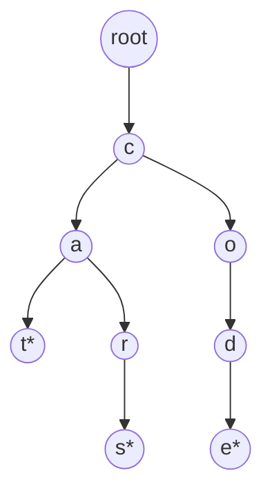
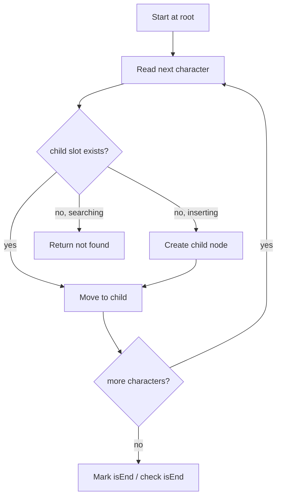

# Trie

## Concept

A trie (prefix tree) is a tree whose edges are labeled with characters, so that every path from the root spells out a string. Strings sharing a common prefix share the same path until they diverge, which makes a trie excellent for prefix queries, autocomplete, and dictionary lookups. Each node carries a set of child links (one per possible character) and a flag marking whether a word ends there. The key property is that lookup, insertion, and prefix testing all run in time proportional to the length of the query string, independent of how many words the trie stores.

## Mermaid



Nodes marked `*` are terminal: "cat", "cars", "code".

## Complexity

- Insert / Search / startsWith: O(L) where L is the length of the key
- Space: O(total characters inserted x alphabet factor); using a fixed 26-array each node costs O(26)
- No dependence on the number of stored words for a single operation

## C++11 Code

```cpp
#include <string>
using namespace std;

struct TrieNode {
    TrieNode* child[26]; // one slot per lowercase letter
    bool isEnd;
    TrieNode() : isEnd(false) {
        for (int i = 0; i < 26; ++i) child[i] = nullptr;
    }
};

struct Trie {
    TrieNode* root;
    Trie() : root(new TrieNode()) {}

    void insert(const string& word) {
        TrieNode* cur = root;
        for (char c : word) {
            int i = c - 'a';
            if (!cur->child[i]) cur->child[i] = new TrieNode();
            cur = cur->child[i];
        }
        cur->isEnd = true; // mark the full word
    }

    // Walk the path; return the node where it ends, or nullptr.
    TrieNode* find(const string& s) const {
        TrieNode* cur = root;
        for (char c : s) {
            int i = c - 'a';
            if (!cur->child[i]) return nullptr;
            cur = cur->child[i];
        }
        return cur;
    }

    bool search(const string& word) const {
        TrieNode* n = find(word);
        return n && n->isEnd;     // path exists AND ends a word
    }

    bool startsWith(const string& prefix) const {
        return find(prefix) != nullptr; // path exists, terminal or not
    }
};
```

## Mini Usage Example

```cpp
Trie t;
t.insert("cat");
t.insert("cars");
t.insert("code");

t.search("cat");        // true
t.search("car");        // false (prefix only, not a stored word)
t.startsWith("car");    // true  (prefix of "cars")
t.startsWith("dog");    // false
```

## Code Snippet Flow


