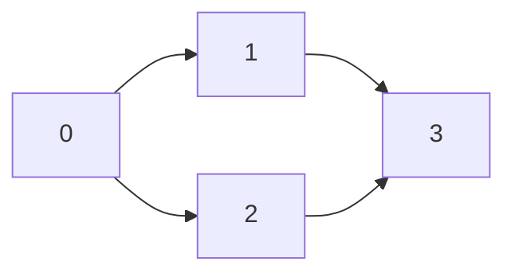
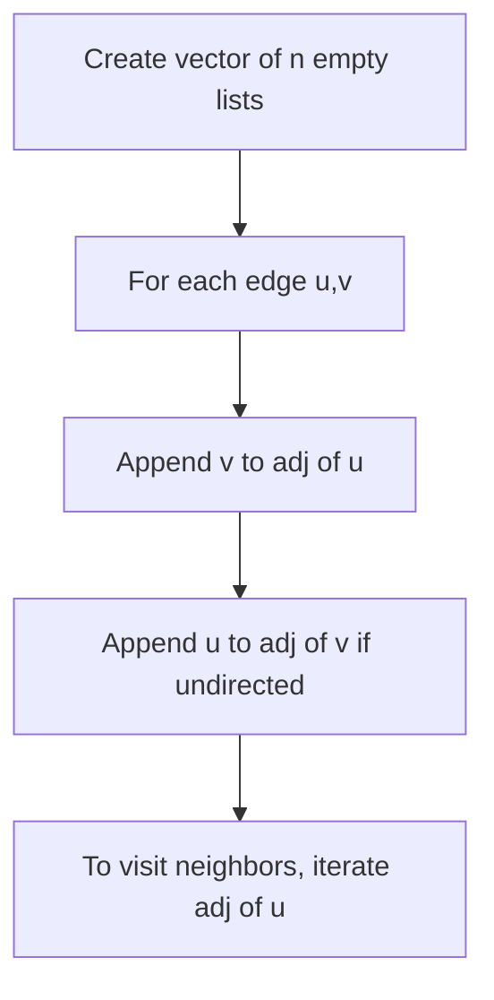

# Adjacency List

## Concept

An adjacency list represents a graph as an array (or vector) of lists, where entry `g[u]` holds every vertex adjacent to `u`. It stores only the edges that actually exist, so its space is O(V + E), which is far more compact than a matrix for sparse graphs. Iterating over a vertex's neighbors is proportional to that vertex's degree, making it the natural representation for traversals like BFS and DFS. The trade-off is that checking whether a specific edge `(u, v)` exists requires scanning `u`'s list rather than a single array lookup.

## Mermaid



List form: `0 -> [1,2]`, `1 -> [3]`, `2 -> [3]`, `3 -> []`.

## Complexity

- Space: O(V + E)
- Add edge: O(1)
- Iterate neighbors of u: O(deg(u))
- Check whether edge (u, v) exists: O(deg(u))
- Full traversal of all edges: O(V + E)

## C++11 Code

```cpp
#include <vector>
#include <iostream>
using namespace std;

struct Graph {
    int n;                       // number of vertices
    vector<vector<int>> adj;     // adj[u] = neighbors of u
    Graph(int n) : n(n), adj(n) {}

    // Undirected edge: record both directions.
    void addEdge(int u, int v) {
        adj[u].push_back(v);
        adj[v].push_back(u);
    }

    void print() const {
        for (int u = 0; u < n; ++u) {
            cout << u << ":";
            for (int v : adj[u]) cout << ' ' << v;
            cout << '\n';
        }
    }
};
```

## Mini Usage Example

```cpp
Graph g(4);
g.addEdge(0, 1);
g.addEdge(0, 2);
g.addEdge(1, 3);
g.addEdge(2, 3);
g.print();
// 0: 1 2
// 1: 0 3
// 2: 0 3
// 3: 1 2
```

## Code Snippet Flow


