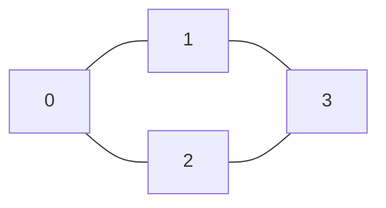

# Adjacency Matrix

## Concept

An adjacency matrix represents a graph as a V x V grid where `m[u][v]` records whether (or how heavily) an edge connects `u` to `v`. Edge existence and weight lookups are therefore constant time, which is convenient for dense graphs and for algorithms that repeatedly test specific edges. The cost is space: it always uses O(V^2) memory regardless of how few edges exist, and iterating a vertex's neighbors takes O(V) even if the vertex has only one neighbor. For an undirected graph the matrix is symmetric (`m[u][v] == m[v][u]`).

## Mermaid



Matrix (rows/cols = vertices 0..3):

```
     0 1 2 3
   0 0 1 1 0
   1 1 0 0 1
   2 1 0 0 1
   3 0 1 1 0
```

## Complexity

- Space: O(V^2)
- Add edge / remove edge: O(1)
- Check whether edge (u, v) exists: O(1)
- Iterate neighbors of u: O(V)
- Full traversal of all edges: O(V^2)

## C++11 Code

```cpp
#include <vector>
#include <iostream>
using namespace std;

struct Graph {
    int n;
    vector<vector<int>> m;       // m[u][v] = 1 if edge exists (0 otherwise)
    // Initialize an n x n matrix filled with zeros.
    Graph(int n) : n(n), m(n, vector<int>(n, 0)) {}

    // Undirected edge: set both symmetric cells.
    void addEdge(int u, int v) {
        m[u][v] = 1;
        m[v][u] = 1;
    }

    bool hasEdge(int u, int v) const { return m[u][v] != 0; }

    void print() const {
        for (int u = 0; u < n; ++u) {
            for (int v = 0; v < n; ++v) cout << m[u][v] << ' ';
            cout << '\n';
        }
    }
};
```

## Mini Usage Example

```cpp
Graph g(4);
g.addEdge(0, 1);
g.addEdge(0, 2);
g.addEdge(1, 3);
g.addEdge(2, 3);

g.hasEdge(0, 1);  // true
g.hasEdge(0, 3);  // false
g.print();
```

## Code Snippet Flow

```mermaid
flowchart TD
    A[Allocate n x n matrix of zeros] --> B[For each edge u,v]
    B --> C[Set m of u,v = 1]
    C --> D[Set m of v,u = 1 if undirected]
    D --> E[Edge query is O(1) lookup of m of u,v]
```
