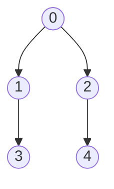
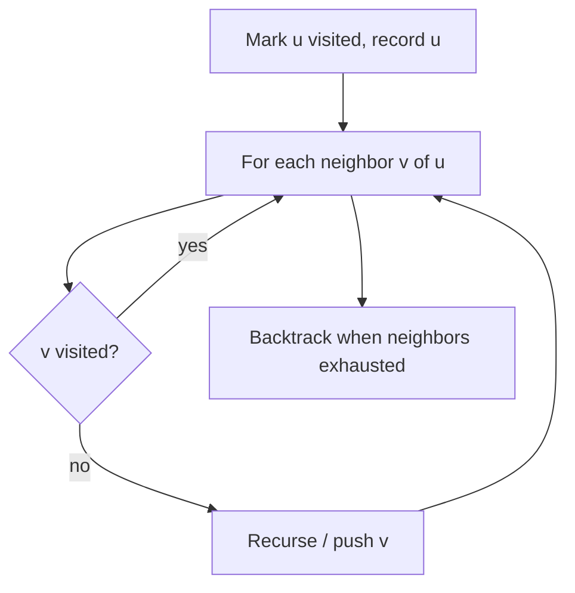

# DFS

## Concept

Depth-first search explores a graph by going as deep as possible along each branch before backtracking. It can be written recursively (using the call stack) or iteratively with an explicit stack, and a visited array prevents revisiting vertices. DFS naturally exposes structural properties of a graph: it is the basis for cycle detection, topological sorting, finding connected components, and discovering bridges or articulation points. Like BFS it runs in O(V + E), but the order in which vertices are reached is deep-first rather than level-first.

## Mermaid



Recursive visit order from 0: `0, 1, 3, 2, 4` (dives down 0->1->3 before backtracking).

## Complexity

- Time: O(V + E) — each vertex and edge processed once
- Space: O(V) for the visited array plus O(V) recursion/stack depth in the worst case

## C++11 Code

```cpp
#include <vector>
#include <stack>
using namespace std;

// Recursive DFS: append vertices in the order they are first visited.
void dfsRecursive(int u, const vector<vector<int>>& g,
                  vector<int>& visited, vector<int>& order) {
    visited[u] = 1;
    order.push_back(u);
    for (int v : g[u])
        if (!visited[v])
            dfsRecursive(v, g, visited, order);
}

// Iterative DFS using an explicit stack.
vector<int> dfsIterative(int src, const vector<vector<int>>& g) {
    vector<int> visited(g.size(), 0), order;
    stack<int> st;
    st.push(src);
    while (!st.empty()) {
        int u = st.top();
        st.pop();
        if (visited[u]) continue;   // may be pushed multiple times
        visited[u] = 1;
        order.push_back(u);
        // Push neighbors; they will be popped (visited) in reverse order.
        for (int v : g[u])
            if (!visited[v]) st.push(v);
    }
    return order;
}
```

## Mini Usage Example

```cpp
// Adjacency list: 0->{1,2}, 1->{3}, 2->{4}, 3->{}, 4->{}
vector<vector<int>> g = {{1, 2}, {3}, {4}, {}, {}};

vector<int> visited(g.size(), 0), order;
dfsRecursive(0, g, visited, order);
// order == {0, 1, 3, 2, 4}

vector<int> order2 = dfsIterative(0, g); // same set, order may differ
```

## Code Snippet Flow


