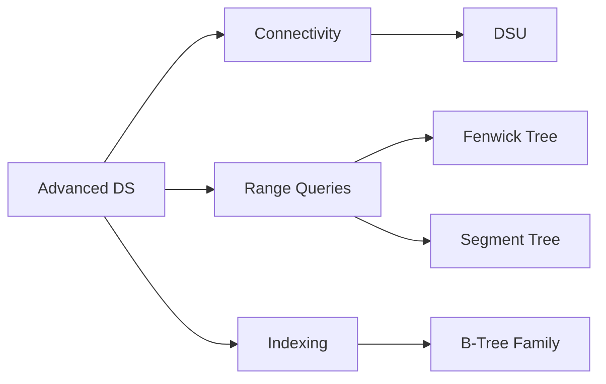

# Advanced Data Structures Overview

This chapter groups structures that are frequently used in algorithm-heavy systems.

## Structure Files

1. [Disjoint Set Union (Union-Find)](structures/disjoint_set_union.md)
2. [Fenwick Tree](structures/fenwick_tree.md)
3. [Segment Tree](structures/segment_tree.md)
4. [Advanced Complexity Table](structures/advanced_complexity_table.md)

## Optional Extensions (Not fully implemented here)

- B-Tree / B+ Tree (database indexing)
- Red-Black Tree (self-balancing BST, used in std::map/std::set)
- Suffix Array / Suffix Tree (string algorithms)
- Bloom Filter (probabilistic membership)

## Mermaid Relationship Map



## Choosing the Right Structure

- Need dynamic connectivity: DSU
- Need prefix sums with point updates: Fenwick
- Need flexible range aggregation: Segment Tree
- Need disk-friendly index: B-Tree/B+ Tree

## Practice

- ../exercises/dsu_exercises.md
- ../exercises/fenwick_tree_exercises.md
- ../exercises/segment_tree_exercises.md

## Production Tip

Prefer battle-tested standard containers and well-reviewed libraries unless custom implementation is required by constraints.

## C++11 Example: Fenwick Tree

```cpp
#include <vector>
using namespace std;

struct Fenwick {
    int n;
    vector<int> bit;
    explicit Fenwick(int n) : n(n), bit(n + 1, 0) {}
    void add(int idx, int val) { for (++idx; idx <= n; idx += idx & -idx) bit[idx] += val; }
    int sumPrefix(int idx) const { int s = 0; for (++idx; idx > 0; idx -= idx & -idx) s += bit[idx]; return s; }
};
```